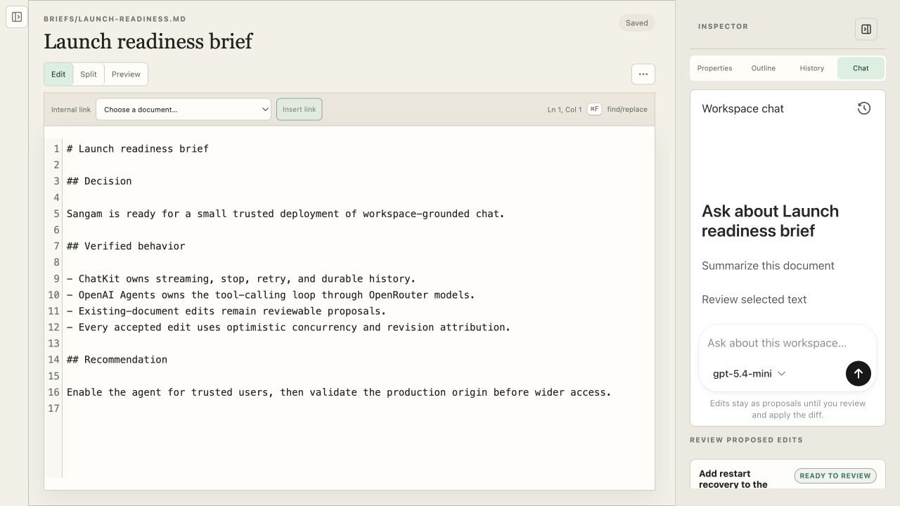
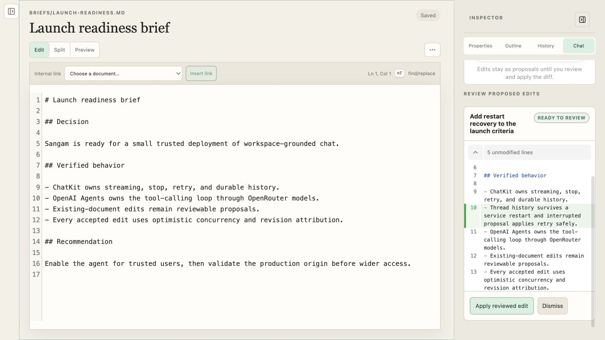

# Sangam

<!-- markdownlint-disable-next-line MD033 -->


[](https://github.com/jayshah5696/sangam/releases/latest)
[](https://github.com/jayshah5696/sangam/actions/workflows/ci.yml)
[](https://github.com/jayshah5696/sangam/pkgs/container/sangam)
[](./LICENSE)

A single-user, self-hosted document workspace where a human and identified AI
agents work with ordinary files through the same small, revision-aware API.

> **Release status:** [Sangam 0.1.0](https://github.com/jayshah5696/sangam/releases/tag/v0.1.0)
> is a published and verified self-hosted beta. Its signed application image is
> public on [GitHub Container Registry](https://github.com/jayshah5696/sangam/pkgs/container/sangam).
> A technically capable operator can deploy it privately by immutable digest;
> production acceptance still requires evidence from that operator's real
> identity, network, storage, backup, and monitoring environment. See the
> [release report](./docs/0.1_RELEASE_REPORT.md) for the exact boundary.

[Install 0.1.0](#install-010) · [Deploy safely](#production-deployment) ·
[Verify the release](#verify-the-release) · [Explore features](#what-sangam-does) ·
[Develop](#development) · [Read the docs](#documentation)

## Why Sangam

Sangam keeps the files you care about ordinary and portable while preserving the
history and trust information that a filesystem alone cannot express. SQLite is
the canonical record for stable identity, immutable revisions, metadata,
provenance, annotations, publications, imports, agent activity, and chat state;
workspace files are readable materializations of the current document revisions.

Humans, the CLI, integrations, and scoped agents all use the same service path.
Every mutation carries an actor, an expected revision, and an idempotency boundary.
That makes concurrent edits recoverable, external actions reviewable, and AI edits
proposals instead of invisible writes.

## What Sangam does

- **Daily document workspace.** Edit Markdown and safe HTML, preview Mermaid,
  search with SQLite FTS5, compare or restore revisions, organize files, recover
  drafts and conflicts, and use keyboard-accessible split editor groups.
- **PDF research.** Import immutable PDFs, search extracted page text, annotate
  text or regions, add notes and citation markers, and keep deep links pinned to
  the exact PDF and page.
- **Controlled publishing.** Publish stable private, public, or unlisted pages.
  Safe HTML stays sanitized; reviewed interactive HTML uses a separate origin,
  short-lived grants, and an opaque sandbox.
- **Scoped agent collaboration.** Issue one-time bearer tokens with explicit
  capabilities, path boundaries, expiry, rotation, and revocation. Accepted,
  denied, conflicted, and failed operations remain attributable and reviewable.
- **Workspace-grounded chat.** Use ChatKit with OpenRouter Responses models,
  durable threads, streaming, stop/retry, revision-pinned citations, and
  human-reviewed edit proposals.
- **Karakeep bridge.** Selectively import archived bookmarks as editable Markdown
  while retaining provenance and keeping refreshes from overwriting human edits.
- **Recovery-aware operations.** Reconcile SQLite with materialized files, create
  generation-consistent paired backups, verify their contents, and expose separate
  health and readiness endpoints.

## Install 0.1.0

The container is the supported complete application artifact. It includes the
browser client, API, migration set, background workers, and CLI and runs as the
unprivileged UID/GID `10001:10001`. The separately published Python wheel and
source archive contain the backend and CLI only; they deliberately do not contain
the browser SPA.

### Requirements

- Docker with Linux container support; the release provides `linux/amd64` and
  `linux/arm64` images.
- Three persistent volumes for the SQLite database, workspace materializations,
  and paired backups.
- A loopback or private-network binding for evaluation. Never expose the default
  `single_user` mode directly to an untrusted network.

### Try the released container locally

Release tags are convenient for evaluation. These named volumes survive container
replacement without requiring host-directory ownership changes:

```bash
docker volume create sangam-database
docker volume create sangam-workspace
docker volume create sangam-backups

docker run --detach --init \
  --name sangam \
  --publish 127.0.0.1:8000:8000 \
  --volume sangam-database:/data/database \
  --volume sangam-workspace:/data/workspace \
  --volume sangam-backups:/data/backups \
  ghcr.io/jayshah5696/sangam:0.1.0
```

Open <http://127.0.0.1:8000>. The public package can be pulled without signing in
to GitHub. Confirm the exact running version and readiness:

```bash
curl --fail http://127.0.0.1:8000/api/v1/health
curl --fail http://127.0.0.1:8000/api/v1/readiness
docker logs sangam
```

Stop and later restart the same data with `docker stop sangam` and
`docker start sangam`. Removing the container does not remove its named volumes.

This path is for private evaluation on localhost. Chat, Karakeep, public
publishing, and trusted interactive preview need their own configuration. A remote
or internet-accessible instance must use the production contract below.

## Production deployment

Production deployments must use the fail-closed Compose definition and pin the
verified immutable image digest, not a mutable release tag:

```text
ghcr.io/jayshah5696/sangam@sha256:8ee161116bfc2976524ccfe57c4ecc1697f151fa7481434a76264137009d4974
```

The digest identifies the exact multi-platform 0.1.0 image index. The `:0.1.0`
tag is easier to read, but a registry tag can be moved; the digest cannot.

### Prepare the host

Clone the release, create the persistent bind-mount directories with the
container's unprivileged identity, and create a deployment environment:

```bash
git clone --branch v0.1.0 --depth 1 https://github.com/jayshah5696/sangam.git
cd sangam
sudo install -d -m 0750 -o 10001 -g 10001 \
  data/database data/workspace data/backups
cp .env.example .env
```

Set the following deployment-specific values in `.env` before starting:

- the Cloudflare Access team URL, application audience, and allowed administrator;
- the HTTPS application/publication URL and a separate HTTPS trusted-preview
  hostname;
- allowed preview parent origins and an independently generated preview HMAC
  secret;
- the registered production ChatKit domain key and application origin; and
- optional OpenRouter and Karakeep server-side credentials when those integrations
  are enabled.

Generate the preview secret with a password manager or:

```bash
python -c 'import secrets; print(secrets.token_urlsafe(48))'
```

Keep secrets out of the repository, browser configuration, URLs, documents, and
support logs. The production definition binds Sangam only to
`127.0.0.1:8000`; use an authenticated reverse proxy or Cloudflare Tunnel and do
not add a public router port-forward.

### Validate and start

```bash
export SANGAM_IMAGE='ghcr.io/jayshah5696/sangam@sha256:8ee161116bfc2976524ccfe57c4ecc1697f151fa7481434a76264137009d4974'
scripts/validate-compose.sh
docker compose -f deploy/compose.prod.yaml config --quiet
docker compose -f deploy/compose.prod.yaml pull
docker compose -f deploy/compose.prod.yaml up -d
docker compose -f deploy/compose.prod.yaml ps
curl --fail http://127.0.0.1:8000/api/v1/readiness
```

`SANGAM_DEPLOYMENT_MODE=production` refuses to start with local authentication,
the development preview secret, HTTP publication or preview URLs, mismatched
preview hosts, unsafe parent/connect origins, incomplete Cloudflare settings, or
the `local-dev` ChatKit registration.

Deployment is not complete when the container merely becomes healthy. Follow the
[release checklist](./docs/operations/RELEASE_CHECKLIST.md) to test Access allow
and deny behavior, trust-zone isolation, publishing policies, real ChatKit and
Karakeep flows, desktop and narrow browser behavior, monitoring, and off-host
restore evidence. Use the [upgrade and rollback runbook](./docs/operations/UPGRADES_AND_ROLLBACK.md)
before changing a running digest.

## Verify the release

Sangam 0.1.0 is built for `linux/amd64` and `linux/arm64`, scanned before push,
signed keylessly with Sigstore, and published with BuildKit SBOM/provenance plus a
GitHub artifact attestation. The [GitHub Release](https://github.com/jayshah5696/sangam/releases/tag/v0.1.0)
also contains the backend/CLI wheel, source archive, and `SHA256SUMS`.

Inspect and verify the exact application image:

```bash
export SANGAM_IMAGE='ghcr.io/jayshah5696/sangam@sha256:8ee161116bfc2976524ccfe57c4ecc1697f151fa7481434a76264137009d4974'

docker buildx imagetools inspect "$SANGAM_IMAGE"

cosign verify "$SANGAM_IMAGE" \
  --certificate-identity-regexp \
  'https://github.com/jayshah5696/sangam/.github/workflows/release.yml@refs/tags/v[0-9].*' \
  --certificate-oidc-issuer https://token.actions.githubusercontent.com

gh attestation verify "oci://$SANGAM_IMAGE" \
  --repo jayshah5696/sangam
```

The GitHub CLI command requires a GitHub login with package read access; anonymous
Docker pulls do not. The [0.1.0 release report](./docs/0.1_RELEASE_REPORT.md) links
the successful release workflow, exact commit, platform manifests, attestations,
Rekor record, checksum verification, and published-image smoke evidence.

## Data, backups, and upgrades

Treat these paths as one recoverable system:

- `/data/database` contains canonical SQLite state;
- `/data/workspace` contains ordinary current-revision materializations; and
- `/data/backups` contains verified paired snapshots.

Never restore a database and workspace tree from different backup generations.
Local verification does not encrypt or replicate a backup and does not prove an
off-host copy exists. Before an upgrade, quiesce writes, create and verify a fresh
paired backup, copy the complete set to a separate failure domain, rehearse the
target digest against a clean restore, and record both the previous digest and
backup ID. Sangam uses forward-only migrations, so rollback after a migration means
restoring the complete pre-upgrade pair as well as the previous image.

The exact commands and acceptance checks live in the
[upgrade and rollback runbook](./docs/operations/UPGRADES_AND_ROLLBACK.md).

## Optional integrations

### Karakeep

Set a read-capable API key and an API root reachable from the Sangam process or
container. The URL must include `/api/v1`:

```dotenv
SANGAM_KARAKEEP_BASE_URL=http://karakeep:3000/api/v1
SANGAM_KARAKEEP_API_KEY=replace-with-karakeep-api-key
SANGAM_KARAKEEP_TIMEOUT_SECONDS=20
SANGAM_MAX_KARAKEEP_SOURCE_BYTES=5000000
```

Keep the key server-side; Sangam never returns it to the browser. After restarting,
open **Karakeep imports** and confirm **Connected** before searching. The
[Karakeep operations guide](./docs/operations/PHASE_6_OPERATIONS.md) covers
credential rotation, source limits, retry behavior, refresh review, and recovery.

### Workspace chat

Add an OpenRouter key, explicit model allowlist, and ChatKit domain registration:

```dotenv
SANGAM_OPENROUTER_API_KEY=replace-with-openrouter-api-key
SANGAM_OPENROUTER_HTTP_REFERER=http://127.0.0.1:8000
SANGAM_CHAT_DEFAULT_MODEL=openai/gpt-5.4-mini
SANGAM_CHAT_AVAILABLE_MODELS=["openai/gpt-5.4-mini","openai/gpt-5.4-nano","openai/gpt-5.6-terra"]
SANGAM_CHATKIT_DOMAIN_KEY=local-dev
SANGAM_OPENROUTER_APP_TITLE=Sangam
```

Use the real HTTPS application origin and its registered ChatKit domain key in
production. The provider key stays in the backend. Existing-document edits remain
revision-pinned proposals until a human reviews and applies the diff. The
[chat operations guide](./docs/operations/PHASE_7_OPERATIONS.md) covers domain
registration, model policy, streaming proxies, key rotation, and recovery.

## Screenshots

### Workspace-grounded agent chat

The document inspector embeds ChatKit's streaming conversation UI, enabled
OpenRouter model picker, durable history, and retry controls beside the active
document. The OpenAI Agents SDK can read authorized workspace context and use
Sangam tools while existing-document changes remain outside the editor until
the human reviews them.



### Human-reviewed chat proposal

An agent-proposed document update is pinned to the revision it reviewed. Sangam
shows the exact addition with Pierre Diffs and keeps apply or dismiss under
human control; applying the change uses the normal attributed, idempotent
document update path.



### Karakeep import and source review

Search remains in Karakeep until a bookmark is selected. Imported sources show
their stable Karakeep identity, original link, tags, attachment descriptors,
archived extraction, and corrected Sangam working copy side by side.


### PDF research workspace

Immutable PDFs open in a dedicated PDF.js reader beside the research rail.
Page-aware text search, annotation filters, replacement imports, stable page
links, and actor-attributed notes remain available without changing the source
bytes.


At narrow widths, the reader and research rail stack into one continuous
workspace. The toolbar wraps while the PDF viewport and research rail retain
their own overflow behavior.


### HTML preview and publication controls

HTML documents use the normal Sangam editor and revision history. Safe preview
keeps embedded presentation CSS while removing scripts and active content. The
preview fills the available document viewport and scrolls inside its isolated
iframe. The inspector reuses Sangam's shared rail and control system for trust
state, stable slug, access policy, publication updates, and unpublishing.


### Stable public publication

The stable publication route renders the current revision without exposing the
workspace UI. Published HTML always uses the sanitized, script-disabled
renderer, including documents separately trusted for interactive preview. The
published document receives the full page below a compact Sangam header and
scrolls independently for long content.


### Pierre-powered document workspace

Sangam starts with one editor and no permanent tab or status strip. Files,
search, agent activity, maintenance tools, document properties, and save state
remain available without forcing a split layout. The `@pierre/trees` explorer
adds keyboard navigation, inline rename, context actions, and drag-and-drop
organization while Sangam keeps document identity stable behind readable paths.


### Revision comparison

The History inspector compares any two revisions with the lazy-loaded
`@pierre/diffs` renderer. Additions and deletions remain readable alongside the
document, revision metadata, and restore or copy actions.


### Scoped agent access

The Agents & tokens settings issue one-time credentials with explicit
capabilities, optional expiry, and workspace path boundaries. Issued tokens can
be rotated or revoked without erasing their historical attribution.


### Reviewable agent activity

The activity timeline keeps accepted, denied, conflicted, and failed agent
operations reviewable without exposing credential secrets or document bodies.
The current empty state keeps actor and outcome filters ready before the first
agent operation is recorded.


## Development

Sangam uses Python 3.13+, `uv`, Node.js, npm, Docker, and `just`. Install the
locked backend and frontend dependencies, then start both live-reload servers:

```bash
uv sync --all-groups
npm --prefix frontend ci
just serve
```

The API runs on <http://127.0.0.1:8000>, the Vite client runs on
<http://127.0.0.1:5173>, and interactive API documentation is available at
<http://127.0.0.1:8000/api/v1/docs>. Development defaults to loopback-only
single-user authentication and local trust-zone URLs; it is not a production
security configuration.

The main verification recipes are:

```bash
just test           # Python and frontend format, build, lint, and tests
just test-docs      # links, Markdown style, and strict Mermaid parsing
just check          # source, docs, config, dependencies, and package smoke
just docker-smoke   # complete application image and restart recovery
```

Build and run a local development image with persistent bind mounts:

```bash
just docker-build
just docker-serve
```

`just docker-serve` rebuilds the image, binds Sangam to
`http://127.0.0.1:8000`, and mounts the three persistent `data/` directories.
Override its defaults when needed, for example:
`just port=8080 image=sangam:dev docker-serve`.

External clients and agents can use the installed `sangam` CLI against the same
HTTP API:

```bash
export SANGAM_API_URL=http://127.0.0.1:8000
uv run sangam --help
uv run sangam list
```

Remote agent or CLI access requires a one-time token issued from **Agents &
tokens** and supplied through `SANGAM_TOKEN`. The
[agent operations guide](./docs/operations/PHASE_3_OPERATIONS.md) documents
capabilities, path scopes, rotation, revocation, and incident response.

## Architecture and trust model

The repository follows a few non-negotiable boundaries:

- SQLite owns identity and revision truth; workspace files are materializations.
- All human, CLI, integration, agent, and chat writes use the same application
  service and optimistic-revision path.
- Agent identity comes from scoped bearer credentials, never a caller-selected
  actor header.
- Existing-document AI edits remain proposals until a human applies them.
- Safe publication, trusted interactive preview, and the authenticated application
  are separate trust zones.
- PDFs are immutable; replacement creates a new stable Document and preserves old
  citations.
- Karakeep remains the archive of record; imported working copies are normal Sangam
  Documents.
- A backup is valid only when its canonical database and workspace snapshot belong
  to the same verified generation.

Start with the [product vision](./docs/VISION.md) for the complete rationale and
the [seven implementation phases](./docs/IMPLEMENTATION_PHASES.md) for the shipped
vertical slices.

## Documentation

### Release and operations

- [0.1.0 release report and evidence](./docs/0.1_RELEASE_REPORT.md)
- [Release checklist and supply-chain verification](./docs/operations/RELEASE_CHECKLIST.md)
- [Production upgrades and paired rollback](./docs/operations/UPGRADES_AND_ROLLBACK.md)
- [After 0.1 discussion backlog](./docs/AFTER_0.1.md)
- [Security policy and private vulnerability reporting](./SECURITY.md)

### Product and implementation

- [Product vision and technical decisions](./docs/VISION.md)
- [Seven-phase vertical implementation](./docs/IMPLEMENTATION_PHASES.md)
- [Phase 1: one Markdown document end to end](./docs/PHASE_1.md)
- [Phase 2: daily workspace](./docs/PHASE_2.md)
- [Phase 3: authenticated scoped agents](./docs/PHASE_3.md)
- [Phase 4: publishing and trusted preview](./docs/PHASE_4.md)
- [Phase 5: PDF research](./docs/PHASE_5.md)
- [Phase 6: Karakeep import](./docs/PHASE_6.md)
- [Phase 7: workspace-grounded chat](./docs/PHASE_7.md)
- [Workspace organization and theming enhancements](./docs/WORKSPACE_BASE.md)

### Design system

- [Brand identity and logo usage](./docs/BRAND.md)
- [UI typography, dimensions, rails, and enforcement](./docs/UI_SYSTEM.md)

### Detailed runbooks

- [Development, deployment, and recovery](./docs/operations/PHASE_1_OPERATIONS.md)
- [Backup, restore, and reconciliation](./docs/operations/PHASE_2_OPERATIONS.md)
- [Agent tokens and incident response](./docs/operations/PHASE_3_OPERATIONS.md)
- [Publication, trusted preview, and Cloudflare](./docs/operations/PHASE_4_OPERATIONS.md)
- [PDF import, extraction, annotation, and recovery](./docs/operations/PHASE_5_OPERATIONS.md)
- [Karakeep connection, import, refresh, and recovery](./docs/operations/PHASE_6_OPERATIONS.md)
- [OpenRouter, ChatKit, and streaming operations](./docs/operations/PHASE_7_OPERATIONS.md)

## Project status and support

Sangam 0.1.0 is a self-hosted beta, not a hosted service or a promise that every
deployment environment has passed production acceptance. Review the
[known follow-up work](./docs/AFTER_0.1.md) before relying on it for irreplaceable
data. In particular, operators still own encrypted off-host replication, restore
drills, monitoring, provider credentials, domain policy, and network exposure.

Use [GitHub Issues](https://github.com/jayshah5696/sangam/issues) for reproducible
bugs and focused feature proposals. Report security problems privately using the
process in [SECURITY.md](./SECURITY.md); do not open a public vulnerability issue.

## License

Sangam is licensed under the [Apache License 2.0](./LICENSE). Third-party
attributions are recorded in [NOTICE.md](./NOTICE.md).
