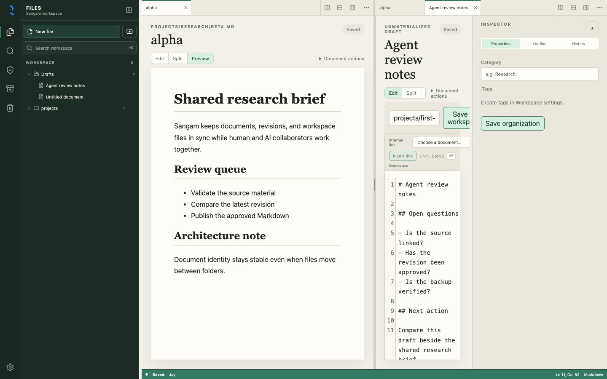
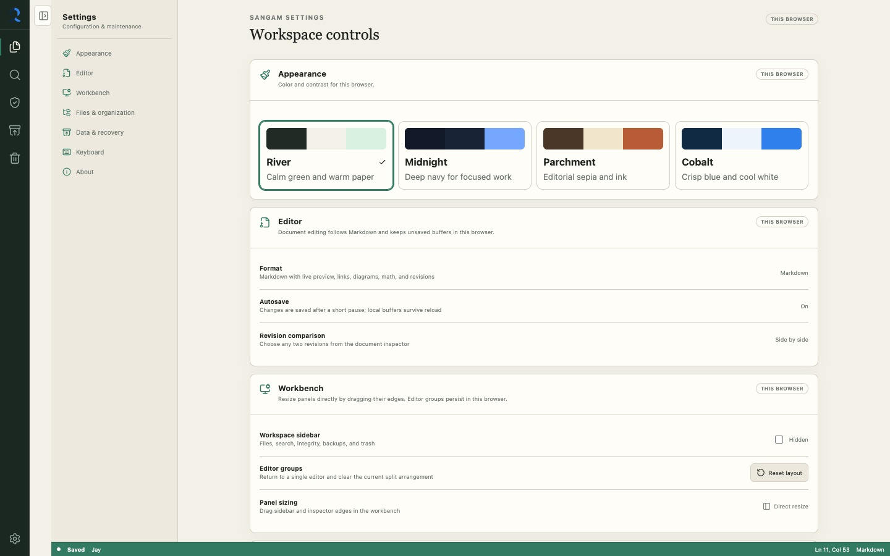

# Sangam

<!-- markdownlint-disable-next-line MD033 -->


A single-user, self-hosted document server where a human and identified AI agents work with ordinary files through the same small API.

Phases 1 and 2 are implemented. The document core now supports a daily-use
Markdown workspace through the browser, HTTP API, CLI, SQLite revision history,
and ordinary workspace files.

The workspace opens with one focused editor and lets each user add persistent
horizontal or vertical editor groups as needed. It also includes document tabs,
a keyboard-accessible file explorer, rich FTS5 search, stable internal links,
rendered Markdown and Mermaid preview, two-revision comparison, explicit
reconciliation, trash/restore, verified nightly backups, a command palette,
resizable panels, and four selectable themes. Editor groups and tabs persist as
layout state, while unsaved document drafts use separate browser storage.
Per-document saves are serialized so a slow response can never replace newer
text in the editor.

## Screenshots

### Focused single-editor workspace

Sangam starts with one editor. Files, search, maintenance tools, document
properties, and save state remain available without forcing a split layout.


### User-created editor groups

Editor groups can be split horizontally or vertically, nested, resized, closed,
and restored with the rest of the browser workbench session.



### Settings and recovery controls

Settings distinguish browser-local preferences from shared workspace metadata
and provide direct routes to reconciliation, backups, trash, and search-index
maintenance.



<details>
<summary>Earlier Phase 1 and Phase 2 UI snapshots</summary>


| Midnight | Parchment |
| --- | --- |
|  |  |


</details>

## Project documents

- [Product vision and technical decisions](./docs/VISION.md)
- [Brand identity and logo usage](./docs/BRAND.md)
- [Seven-phase vertical implementation](./docs/IMPLEMENTATION_PHASES.md)
- [Phase 1 implementation and verification](./docs/PHASE_1.md)
- [Phase 2 implementation and verification](./docs/PHASE_2.md)
- [Phase 1 development, deployment, and recovery operations](./docs/operations/PHASE_1_OPERATIONS.md)
- [Phase 2 development, backup, and restore operations](./docs/operations/PHASE_2_OPERATIONS.md)
- [Workspace organization and theming enhancements](./docs/WORKSPACE_BASE.md)

## Quick start

```bash
uv sync --all-groups
npm --prefix frontend ci
just serve
```

The development server runs the API on `http://127.0.0.1:8000` and the Vite
frontend on `http://127.0.0.1:5173`.

Run the backend tests and frontend verification:

```bash
just test
just test-docs
```

Build or serve the production container:

```bash
just docker-build
just docker-serve
just docker-smoke
```

`just docker-serve` rebuilds the image, binds Sangam to
`http://127.0.0.1:8000`, and mounts the three persistent `data/` directories.
Override its defaults when needed, for example:
`just port=8080 image=sangam:dev docker-serve`.
