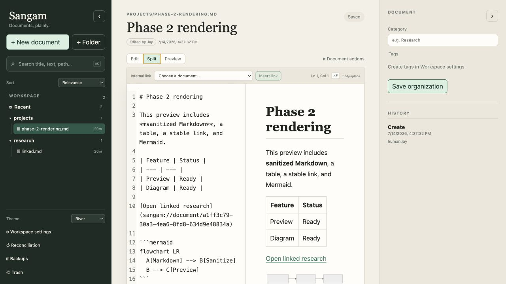
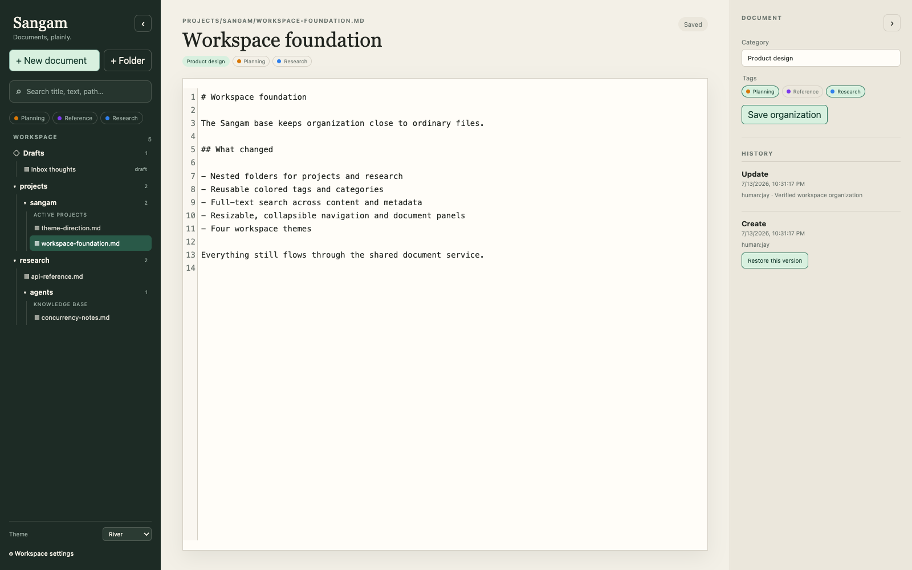
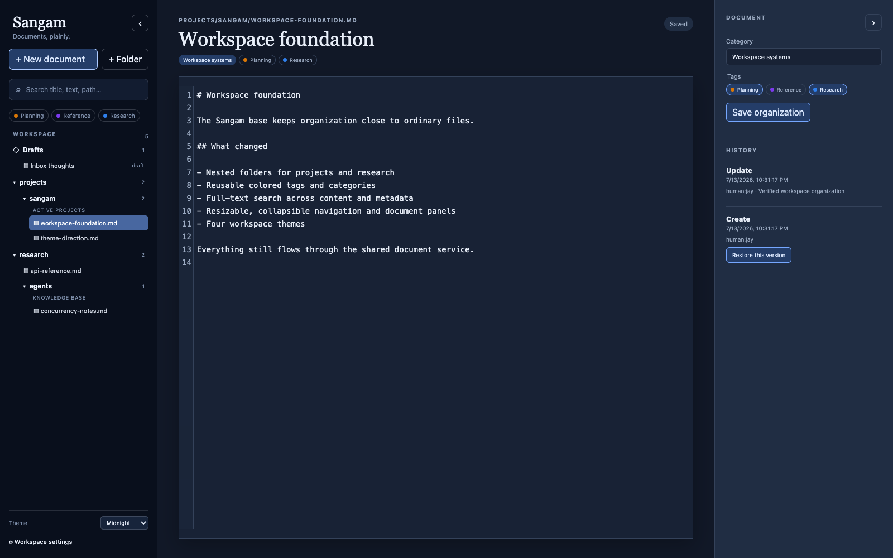
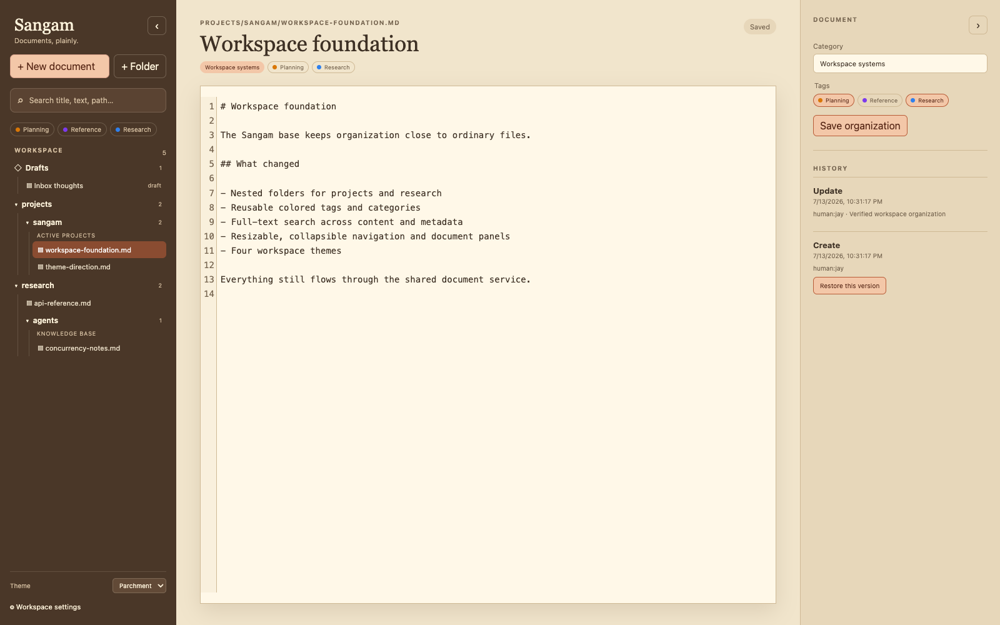
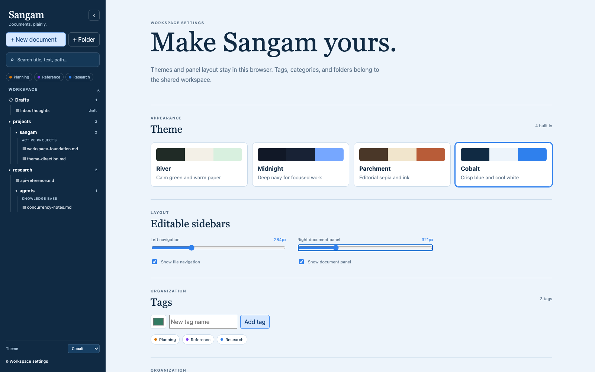
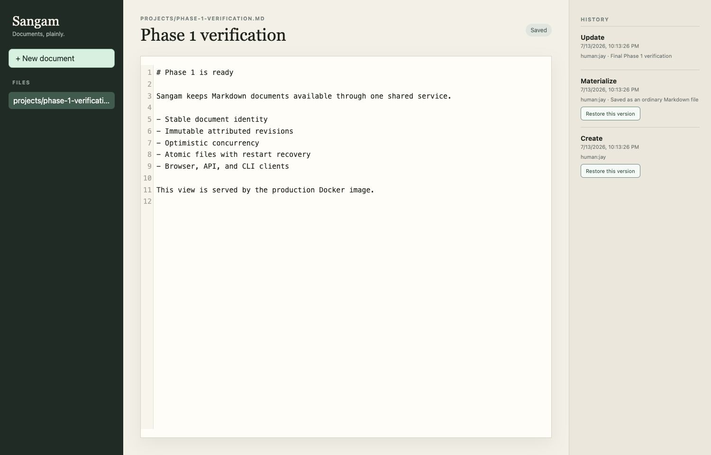

# Sangam

A single-user, self-hosted document server where a human and identified AI agents work with ordinary files through the same small API.

Phases 1 and 2 are implemented. The document core now supports a daily-use
Markdown workspace through the browser, HTTP API, CLI, SQLite revision history,
and ordinary workspace files.

The workspace includes nested navigation, rich FTS5 search, stable internal
links, rendered Markdown and Mermaid preview, revision diffs, explicit
reconciliation, trash/restore, verified nightly backups, resizable sidebars, and
four selectable themes.

## Screenshots

### Phase 2 Markdown workspace



### River workspace



| Midnight | Parchment |
| --- | --- |
|  |  |

### Cobalt workspace settings



<details>
<summary>Phase 1 baseline</summary>



</details>

## Project documents

- [Product vision and technical decisions](./docs/VISION.md)
- [Seven-phase vertical implementation](./docs/IMPLEMENTATION_PHASES.md)
- [Phase 1 implementation and verification](./docs/PHASE_1.md)
- [Phase 2 implementation and verification](./docs/PHASE_2.md)
- [Phase 1 development, deployment, and recovery operations](./docs/operations/PHASE_1_OPERATIONS.md)
- [Phase 2 development, backup, and restore operations](./docs/operations/PHASE_2_OPERATIONS.md)
- [Workspace organization and theming enhancements](./docs/WORKSPACE_BASE.md)

## Quick start

```bash
uv sync --all-groups
npm --prefix frontend ci
just serve
```

The development server runs the API on `http://127.0.0.1:8000` and the Vite
frontend on `http://127.0.0.1:5173`.

Run the backend tests and frontend verification:

```bash
just test
just test-docs
```

Build or serve the production container:

```bash
just docker-build
just docker-serve
just docker-smoke
```

`just docker-serve` rebuilds the image, binds Sangam to
`http://127.0.0.1:8000`, and mounts the three persistent `data/` directories.
Override its defaults when needed, for example:
`just port=8080 image=sangam:dev docker-serve`.
