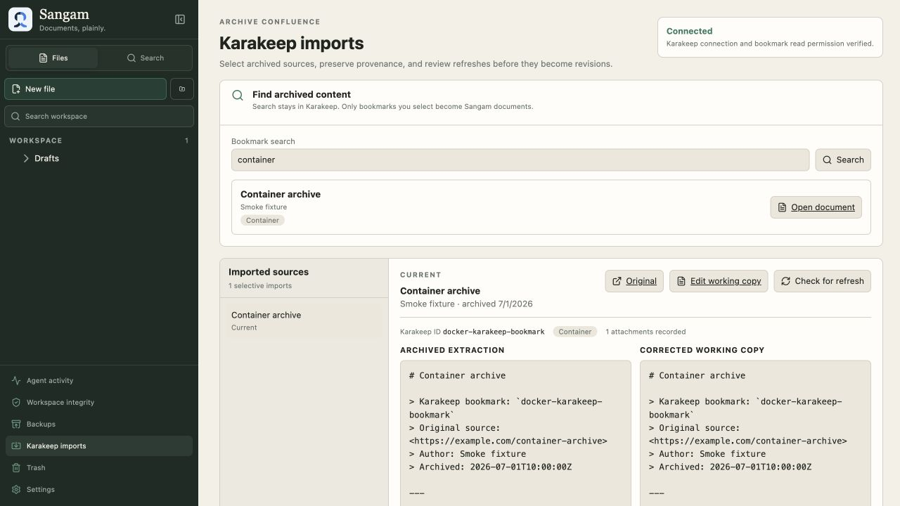
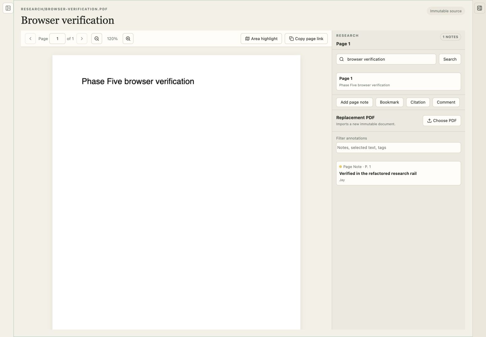
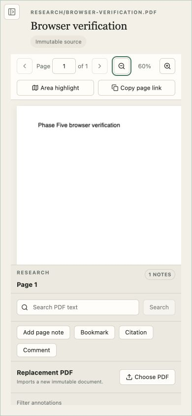
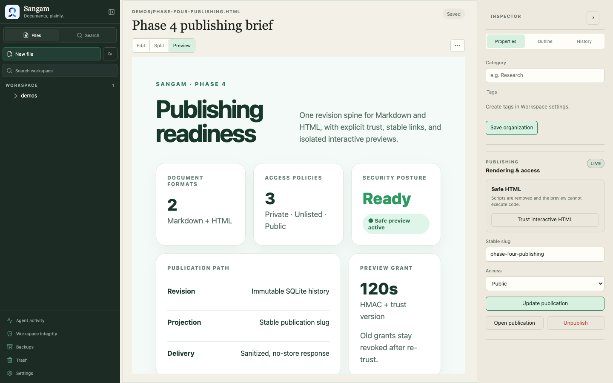
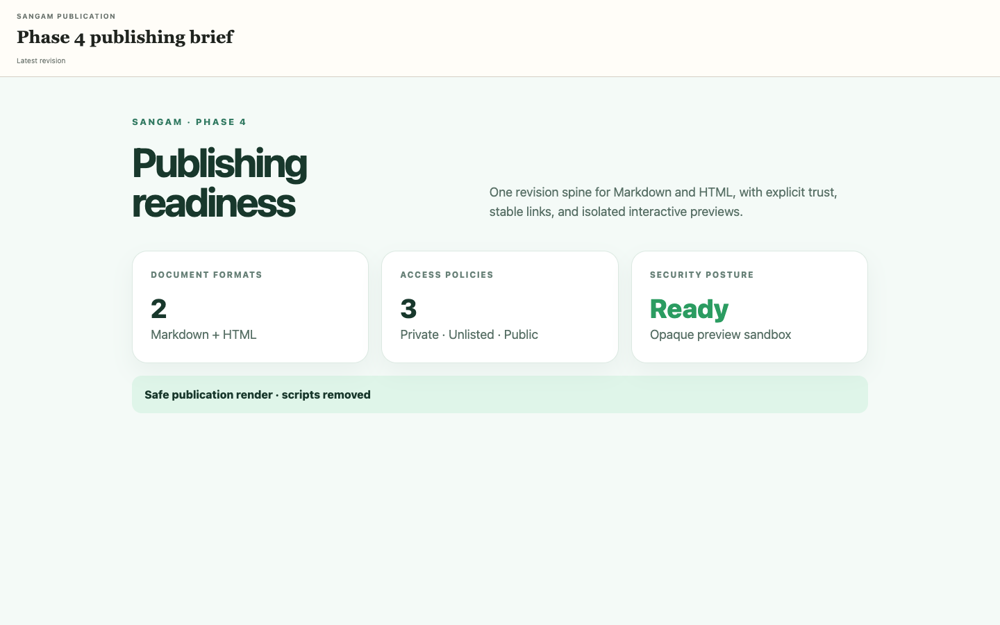
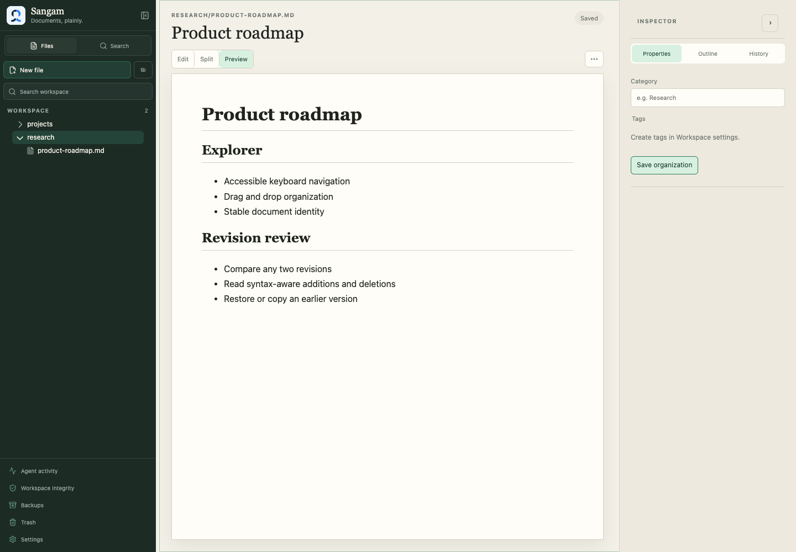
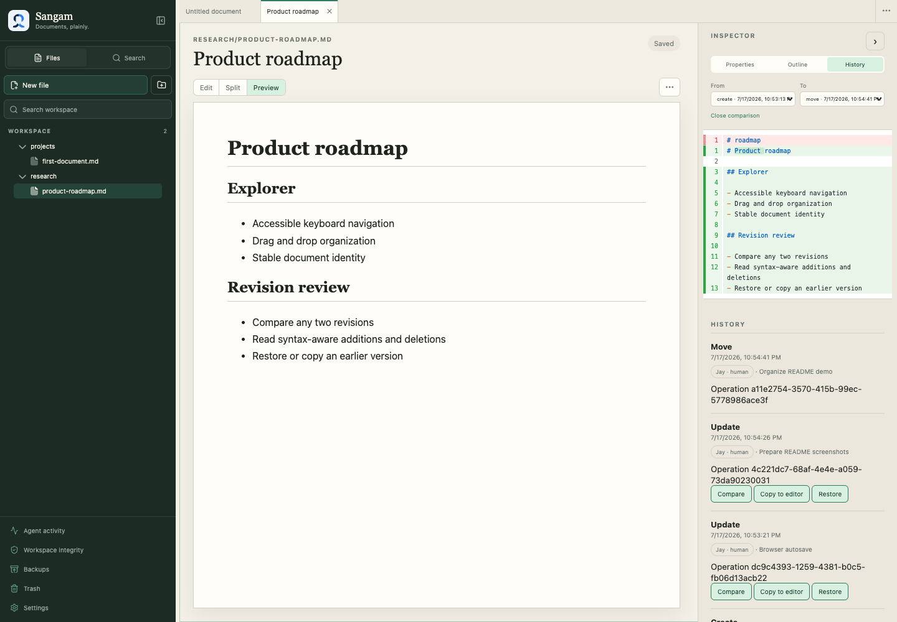
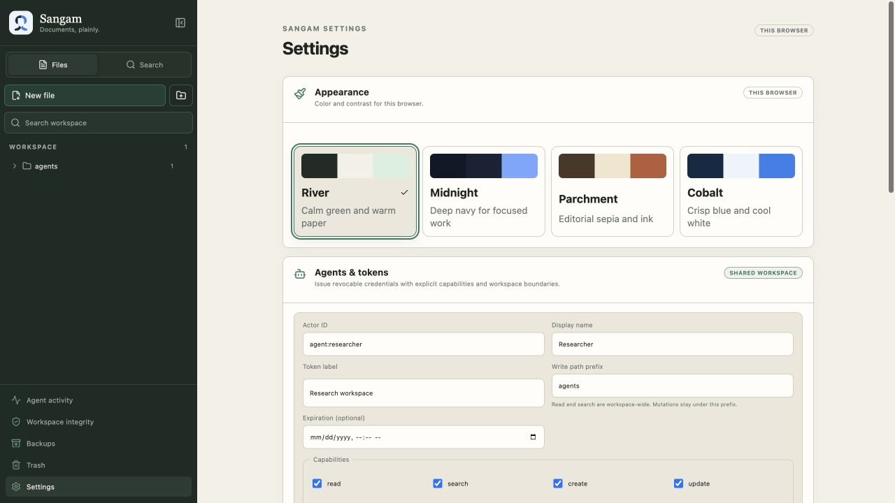
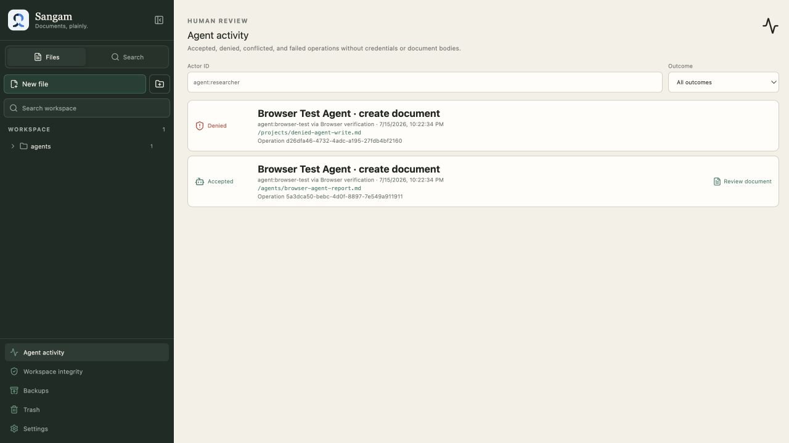

# Sangam

<!-- markdownlint-disable-next-line MD033 -->


A single-user, self-hosted document server where a human and identified AI agents work with ordinary files through the same small API.

All seven vertical phases are implemented locally. The document core now supports a daily-use
Markdown, HTML, and immutable PDF research workspace through the browser, HTTP
API, CLI, SQLite revision and annotation history, and ordinary workspace files.

The workspace opens with one focused editor and reveals tabs only when a group
contains more than one document. Users can add persistent horizontal,
vertical, or nested editor groups from file actions, document actions, or the
command palette. Narrow horizontal layouts stack automatically instead of
crushing the editor. Sangam also includes a keyboard-accessible file explorer,
rich FTS5 search, stable internal links,
rendered Markdown and Mermaid preview, two-revision comparison, explicit
reconciliation, trash/restore, verified nightly backups, a command palette,
resizable panels, and four selectable themes. Validated editor-group and tab
state persists in the browser, while unsaved document drafts use separate
browser storage.
Per-document saves are serialized so a slow response can never replace newer
text in the editor.

External agents can now authenticate with one-time Sangam bearer tokens,
receive deny-by-default capabilities and path scopes, work through the same
optimistic document API as the human, and leave reviewable accepted, denied,
and conflicted activity. Token secrets are stored only as secure hashes and can
be expired, revoked, or rotated from the browser.

Markdown and safe HTML can now be published at stable private, public, or
unlisted URLs. Explicit historical revisions remain non-enumerable until
exposed. Trusted interactive HTML runs only through a separate preview origin
with a short-lived HMAC grant and an opaque sandbox; published HTML remains
sanitized.

PDFs can now be imported as immutable binary Documents, rendered with PDF.js,
searched by extracted page text, and researched with text or area highlights,
notes, comments, bookmarks, citation markers, colors, tags, stable deep links,
and actor-attributed annotation history. Replacement PDFs receive new stable
IDs and explicit `supersedes` relationships, so prior citations continue to
reference the exact original bytes.

Selected Karakeep bookmarks can now be searched and imported as editable
Markdown without turning Sangam into a second archive. Sangam keeps stable
Karakeep provenance, source tags and attachment descriptors, attributes the
initial revision to `integration:karakeep`, and prevents duplicate Documents by
bookmark ID. Refreshes preserve the corrected working copy and wait in a
side-by-side review state until a human applies a normal attributed revision.

Workspace chat uses ChatKit React and ChatKit Python for the UI, durable thread
protocol, streaming, stop, retry, and history. The OpenAI Agents SDK owns the
tool loop, while OpenRouter supplies configurable OpenAI-compatible Responses
models. Sangam's code remains limited to authorized workspace tools,
revision-pinned citations, and human-reviewed edit proposals.

## Configure Karakeep

For a Docker Compose deployment, copy the example environment file and set a
read-capable Karakeep API key:

```bash
cp .env.example .env
```

Uncomment and edit these values in `.env`:

```dotenv
SANGAM_KARAKEEP_BASE_URL=http://karakeep:3000/api/v1
SANGAM_KARAKEEP_API_KEY=replace-with-karakeep-api-key
SANGAM_KARAKEEP_TIMEOUT_SECONDS=20
SANGAM_MAX_KARAKEEP_SOURCE_BYTES=5000000
```

The base URL must be reachable from the Sangam process or container and must
include `/api/v1`. Generate the key from Karakeep's API-key settings and keep it
server-side; Sangam never sends it to the browser. Apply the configuration with:

```bash
docker compose up -d --build
```

Open **Karakeep imports** and confirm that the connection card reports
**Connected** before searching. See
[Phase 6 operations](./docs/operations/PHASE_6_OPERATIONS.md) for native-process
configuration, credential rotation, source limits, retry behavior, and recovery.

## Configure workspace chat

Add an OpenRouter key and an explicit model allowlist to `.env`:

```dotenv
SANGAM_OPENROUTER_API_KEY=replace-with-openrouter-api-key
SANGAM_CHAT_DEFAULT_MODEL=openai/gpt-5.4-mini
SANGAM_CHAT_AVAILABLE_MODELS=["openai/gpt-5.4-mini","openai/gpt-5.4-nano","openai/gpt-5.6-terra"]
SANGAM_CHATKIT_DOMAIN_KEY=local-dev
SANGAM_OPENROUTER_APP_TITLE=Sangam
```

Open a document, select **Chat** in its inspector, and choose an enabled model
from ChatKit's composer. Existing-document edits remain proposals until the
human reviews and applies the diff. See
[Phase 7 operations](./docs/operations/PHASE_7_OPERATIONS.md) for production
domain registration, Cloudflare streaming checks, model changes, and key rotation.

## Screenshots

### Karakeep import and source review

Search remains in Karakeep until a bookmark is selected. Imported sources show
their stable Karakeep identity, original link, tags, attachment descriptors,
archived extraction, and corrected Sangam working copy side by side.



### PDF research workspace

Immutable PDFs open in a dedicated PDF.js reader beside the research rail.
Page-aware text search, annotation filters, replacement imports, stable page
links, and actor-attributed notes remain available without changing the source
bytes.



At narrow widths, the reader and research rail stack into one continuous
workspace. The toolbar wraps while the PDF viewport and research rail retain
their own overflow behavior.



### HTML preview and publication controls

HTML documents use the normal Sangam editor and revision history. Safe preview
keeps embedded presentation CSS while removing scripts and active content. The
preview fills the available document viewport and scrolls inside its isolated
iframe. The inspector reuses Sangam's shared rail and control system for trust
state, stable slug, access policy, publication updates, and unpublishing.



### Stable public publication

The stable publication route renders the current revision without exposing the
workspace UI. Published HTML always uses the sanitized, script-disabled
renderer, including documents separately trusted for interactive preview. The
published document receives the full page below a compact Sangam header and
scrolls independently for long content.



### Pierre-powered document workspace

Sangam starts with one editor and no permanent tab or status strip. Files,
search, agent activity, maintenance tools, document properties, and save state
remain available without forcing a split layout. The `@pierre/trees` explorer
adds keyboard navigation, inline rename, context actions, and drag-and-drop
organization while Sangam keeps document identity stable behind readable paths.



### Revision comparison

The History inspector compares any two revisions with the lazy-loaded
`@pierre/diffs` renderer. Additions and deletions remain readable alongside the
document, revision metadata, and restore or copy actions.



### Scoped agent access

The Agents & tokens settings issue one-time credentials with explicit
capabilities, optional expiry, and workspace path boundaries. Issued tokens can
be rotated or revoked without erasing their historical attribution.



### Reviewable agent activity

The activity timeline keeps accepted, denied, conflicted, and failed agent
operations reviewable without exposing credential secrets or document bodies.
The current empty state keeps actor and outcome filters ready before the first
agent operation is recorded.



## Project documents

- [Product vision and technical decisions](./docs/VISION.md)
- [Brand identity and logo usage](./docs/BRAND.md)
- [UI typography, dimensions, rails, and enforcement](./docs/UI_SYSTEM.md)
- [Seven-phase vertical implementation](./docs/IMPLEMENTATION_PHASES.md)
- [Phase 1 implementation and verification](./docs/PHASE_1.md)
- [Phase 2 implementation and verification](./docs/PHASE_2.md)
- [Phase 3 implementation and verification](./docs/PHASE_3.md)
- [Phase 4 implementation and verification](./docs/PHASE_4.md)
- [Phase 5 implementation and verification](./docs/PHASE_5.md)
- [Phase 6 implementation and verification](./docs/PHASE_6.md)
- [Phase 7 implementation and verification](./docs/PHASE_7.md)
- [Phase 1 development, deployment, and recovery operations](./docs/operations/PHASE_1_OPERATIONS.md)
- [Phase 2 development, backup, and restore operations](./docs/operations/PHASE_2_OPERATIONS.md)
- [Phase 3 agent-token and incident-response operations](./docs/operations/PHASE_3_OPERATIONS.md)
- [Phase 4 publication, preview, and Cloudflare operations](./docs/operations/PHASE_4_OPERATIONS.md)
- [Phase 5 PDF import, extraction, annotation, and recovery operations](./docs/operations/PHASE_5_OPERATIONS.md)
- [Phase 6 Karakeep connection, import, refresh, and recovery operations](./docs/operations/PHASE_6_OPERATIONS.md)
- [Phase 7 OpenRouter, ChatKit, and Cloudflare streaming operations](./docs/operations/PHASE_7_OPERATIONS.md)
- [Workspace organization and theming enhancements](./docs/WORKSPACE_BASE.md)

## Quick start

```bash
uv sync --all-groups
npm --prefix frontend ci
just serve
```

The development server runs the API on `http://127.0.0.1:8000` and the Vite
frontend on `http://127.0.0.1:5173`.

Run the backend tests and frontend verification:

```bash
just test
just test-docs
```

Build or serve the production container:

```bash
just docker-build
just docker-serve
just docker-smoke
```

`just docker-serve` rebuilds the image, binds Sangam to
`http://127.0.0.1:8000`, and mounts the three persistent `data/` directories.
Override its defaults when needed, for example:
`just port=8080 image=sangam:dev docker-serve`.
