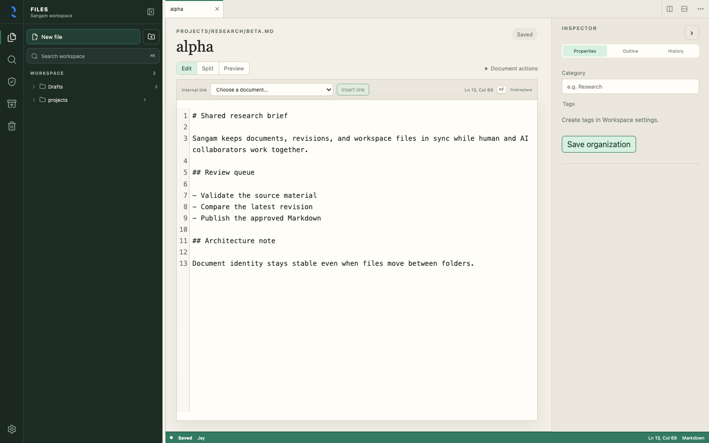

# Sangam

<!-- markdownlint-disable-next-line MD033 -->


A single-user, self-hosted document server where a human and identified AI agents work with ordinary files through the same small API.

Phases 1 through 4 are implemented. The document core now supports a daily-use
Markdown and HTML workspace through the browser, HTTP API, CLI, SQLite revision
history, and ordinary workspace files.

The workspace opens with one focused editor and reveals tabs only when a group
contains more than one document. Users can add persistent horizontal,
vertical, or nested editor groups from file actions, document actions, or the
command palette. Narrow horizontal layouts stack automatically instead of
crushing the editor. Sangam also includes a keyboard-accessible file explorer,
rich FTS5 search, stable internal links,
rendered Markdown and Mermaid preview, two-revision comparison, explicit
reconciliation, trash/restore, verified nightly backups, a command palette,
resizable panels, and four selectable themes. Validated editor-group and tab
state persists in the browser, while unsaved document drafts use separate
browser storage.
Per-document saves are serialized so a slow response can never replace newer
text in the editor.

External agents can now authenticate with one-time Sangam bearer tokens,
receive deny-by-default capabilities and path scopes, work through the same
optimistic document API as the human, and leave reviewable accepted, denied,
and conflicted activity. Token secrets are stored only as secure hashes and can
be expired, revoked, or rotated from the browser.

Markdown and safe HTML can now be published at stable private, public, or
unlisted URLs. Explicit historical revisions remain non-enumerable until
exposed. Trusted interactive HTML runs only through a separate preview origin
with a short-lived HMAC grant and an opaque sandbox; published HTML remains
sanitized.

## Screenshots

### Focused document workspace

Sangam starts with one editor and no permanent tab or status strip. Files,
search, agent activity, maintenance tools, document properties, and save state
remain available without forcing a split layout.



### Scoped agent access

The Agents & tokens settings issue one-time credentials with explicit
capabilities, optional expiry, and workspace path boundaries. Issued tokens can
be rotated or revoked without erasing their historical attribution.


### Reviewable agent activity

The activity timeline keeps accepted, denied, conflicted, and failed agent
operations reviewable without exposing credential secrets or document bodies.
Events retain actor, token label, path, outcome, operation ID, and document links
where applicable.


## Project documents

- [Product vision and technical decisions](./docs/VISION.md)
- [Brand identity and logo usage](./docs/BRAND.md)
- [Seven-phase vertical implementation](./docs/IMPLEMENTATION_PHASES.md)
- [Phase 1 implementation and verification](./docs/PHASE_1.md)
- [Phase 2 implementation and verification](./docs/PHASE_2.md)
- [Phase 3 implementation and verification](./docs/PHASE_3.md)
- [Phase 4 implementation and verification](./docs/PHASE_4.md)
- [Phase 1 development, deployment, and recovery operations](./docs/operations/PHASE_1_OPERATIONS.md)
- [Phase 2 development, backup, and restore operations](./docs/operations/PHASE_2_OPERATIONS.md)
- [Phase 3 agent-token and incident-response operations](./docs/operations/PHASE_3_OPERATIONS.md)
- [Phase 4 publication, preview, and Cloudflare operations](./docs/operations/PHASE_4_OPERATIONS.md)
- [Workspace organization and theming enhancements](./docs/WORKSPACE_BASE.md)

## Quick start

```bash
uv sync --all-groups
npm --prefix frontend ci
just serve
```

The development server runs the API on `http://127.0.0.1:8000` and the Vite
frontend on `http://127.0.0.1:5173`.

Run the backend tests and frontend verification:

```bash
just test
just test-docs
```

Build or serve the production container:

```bash
just docker-build
just docker-serve
just docker-smoke
```

`just docker-serve` rebuilds the image, binds Sangam to
`http://127.0.0.1:8000`, and mounts the three persistent `data/` directories.
Override its defaults when needed, for example:
`just port=8080 image=sangam:dev docker-serve`.
