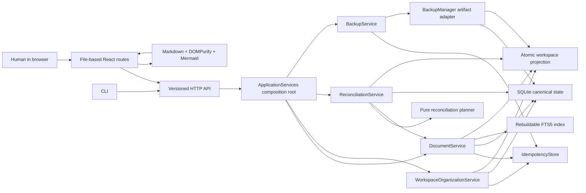
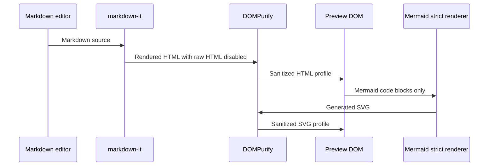

# Phase 2 implementation: a useful Markdown workspace

Phase 2 is implemented as a complete browser-first Markdown workspace on top of
the Phase 1 document core. Paths organize files, but stable document IDs remain
the identity boundary. Every document mutation still passes through the HTTP
API and `DocumentService` and produces attributed, recoverable state.

## Delivered workflow

A human can now:

- Navigate nested folders, drafts, recent documents, tags, and sorted search
  results through file-based browser routes.
- Search title, path, current content, tags, category, historical actors, and
  revision summaries with ranked, highlighted snippets.
- Create, rename, move, duplicate, trash, and restore Markdown documents.
- Insert links whose labels use familiar paths while their targets use stable
  document IDs.
- Edit with syntax highlighting, selection position, search and replace,
  serialized per-document autosave, conflict retention, explicit offline/error
  states, and reload recovery from browser-local draft storage.
- Switch between editor, split, and preview modes.
- Render CommonMark-style Markdown, tables, external links, internal document
  links, and Mermaid diagrams through a sanitized preview.
- Inspect revision metadata, compare line-oriented diffs, copy an old revision
  into the editor, or restore it as a new revision.
- Resolve every reconciliation conflict in the browser: import a disk edit,
  restore the database projection, recognize a move, import an unknown file, or
  ignore one exact unknown-file hash.
- Create, inspect, and re-verify self-contained database and workspace backups.

## Architecture



This preserves the vision's load-bearing boundary: browser routes are clients,
not alternate writers. The FTS index is derived and rebuildable. Workspace files
remain durable projections. Backup artifacts never replace revision history, and
revision history never replaces backups. Folder and tag transactions live behind
`WorkspaceOrganizationService`; actor-scoped retry keys are coordinated by
`IdempotencyStore` across document and workspace-resource mutations.

`ApplicationServices` is the process composition root: it constructs the
database, workspace, indexes, adapters, and application services once, then
routes each API family to the service that owns its policy. `ReconciliationService`
owns conflict persistence and recovery orchestration but can mutate documents
only through a narrow lifecycle protocol, preserving revision attribution and
optimistic concurrency. `BackupService` owns actor and retry semantics while
`BackupManager` remains limited to creating, verifying, retaining, and restoring
backup artifacts. The FTS5 adapter stays derived and rebuildable; canonical
document hydration and sorting do not move into the index.

## Rendering and link safety



Raw HTML is disabled in the Markdown parser, and rendered HTML is sanitized
again before insertion. Mermaid is lazy-loaded, configured with `securityLevel:
"strict"`, and its generated SVG is sanitized separately. External links receive
`noopener noreferrer`; `sangam://document/<document_id>` links are rewritten to
the file route for that stable ID.

This follows DOMPurify's recommended `sanitize()` and HTML-profile usage and
Mermaid's strict-mode behavior, where HTML is encoded and click functionality is
disabled by default. See the [DOMPurify project documentation][dompurify] and
[Mermaid `securityLevel` reference][mermaid-security].

## Search design

The Phase 2 migrations rebuild the FTS5 table with title, path, content, tags,
category, revision actors, and revision summaries. Search uses prefix terms,
`bm25()` ordering, and `snippet()` markers. Actor filtering resolves all matching
document IDs through one indexed query rather than per-result lookups. Results
remain ordinary `Document` responses with an optional snippet, so existing API
clients retain the document shape. The index is synchronized after accepted
mutations and can be rebuilt explicitly with `POST /api/v1/search/reindex`.

The ranking and snippet behavior is based on the official [SQLite FTS5
documentation][sqlite-fts5].

## Backup and restore design

Each backup set is staged and atomically renamed into place only after it
contains:

- An online SQLite backup made with `sqlite3.Connection.backup()`.
- A compressed snapshot of the entire workspace directory.
- A manifest with artifact sizes, SHA-256 checksums, document/revision counts,
  creation time, and verification time.

Verification checks both artifact hashes, `PRAGMA integrity_check`, and archive
member safety. The scheduled task checks hourly and creates at most one set per
UTC day. Retention keeps the newest 14 sets by default. The online-backup choice
is supported by Python's documented guarantee that `Connection.backup()` works
while the database is being accessed; see the [Python `sqlite3` backup
reference][python-sqlite-backup].

Manual backup creation, tag creation, and folder mutations require idempotency
keys. A retry returns the reserved resource instead of duplicating backup sets or
metadata events; reusing a key for different input returns `409`.

Restore is deliberately offline and operational rather than an in-app mutation.
See [Phase 2 operations](./operations/PHASE_2_OPERATIONS.md) for the verified
stop, stage, restore, and boot procedure.

## Verification map

Automated backend coverage includes:

- Duplicate, rename/update, diff, recoverable delete, and undelete behavior.
- Historical actor and revision-summary search, snippets, filters, sorting, and
  explicit index rebuild, including a constant database-connection count for
  actor filtering.
- Every reconciliation decision, including hash-bound ignore behavior and safe
  retries after a document mutation succeeds but conflict resolution is interrupted.
- Online backup creation, checksums, SQLite integrity, safe extraction, restore
  into empty targets, successful service boot from the restored set, and
  idempotent manual-backup retries.
- Idempotent tag and folder creation and folder-metadata retries.
- All Phase 1 lifecycle, concurrency, idempotency, path, recovery, and
  reconciliation cases.

Frontend verification includes:

- Production TypeScript build and ESLint.
- Stable-ID link unit tests.
- A real browser pass proving Markdown tables, sanitized raw HTML, non-executing
  script text, Mermaid SVG output, stable-link navigation, backup creation,
  reconciliation routing, mobile layout without horizontal overflow, and a
  clean browser console.
- Markdown lint plus local-link and Mermaid-fence validation for project docs.

Run the full local suite:

```bash
just test
just test-docs
```

Run the production deployment smoke test:

```bash
just docker-smoke
```

## Phase boundary

Phase 2 does not add agent credentials, scoped agent authorization, editable
HTML documents, public publishing, PDF reading, Karakeep import, or AI chat.
Those remain in Phases 3–7. Markdown preview in this phase is deliberately safe
and non-interactive; Phase 4 owns the separate trusted-HTML execution policy.

## References

- [SQLite FTS5 extension][sqlite-fts5]
- [Python `sqlite3.Connection.backup()`][python-sqlite-backup]
- [DOMPurify][dompurify]
- [Mermaid `securityLevel` configuration][mermaid-security]

[sqlite-fts5]: https://www.sqlite.org/fts5.html
[python-sqlite-backup]: https://docs.python.org/3/library/sqlite3.html#sqlite3.Connection.backup
[dompurify]: https://github.com/cure53/DOMPurify
[mermaid-security]: https://mermaid.js.org/config/schema-docs/config-properties-securitylevel.html
