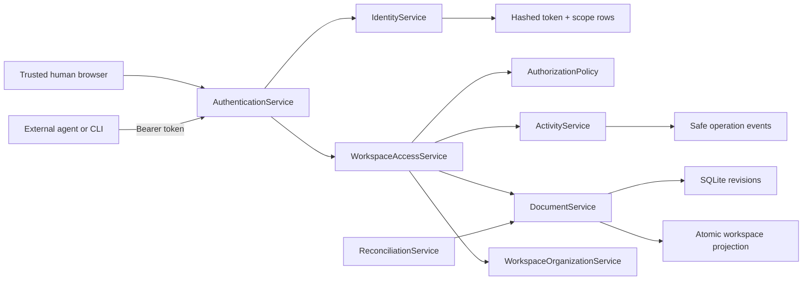

# Phase 3 implementation: agents as real collaborators

Phase 3 makes external agents authenticated clients of the same document API
used by the browser. It does not introduce an agent backdoor or an alternate
write path. Accepted agent changes still use the Phase 1 revision protocol,
workspace materialization, optimistic concurrency, and actor-scoped
idempotency.

## Delivered workflow

A human can now:

- Create a persistent agent identity and issue a labeled, expiring token.
- Grant workspace-wide read/search while restricting mutations to a prefix
  such as `/agents/**`.
- Copy the bearer token once; Sangam retains only its SHA-256 digest.
- Inspect last use, revoke a token, or rotate it into a replacement credential.
- Review accepted, denied, conflicted, and failed agent operations without
  exposing credentials or document bodies.
- Follow accepted activity to the document and see the actor type, display
  name, immutable revision, diff, and operation ID.

An external agent can use the HTTP API or CLI to search and read the workspace,
create and revise a report in an allowed path, receive a structured denial
outside that path, and recover from a real `409` conflict by reading the current
head and retrying with its revision ID.

## Architecture



`WorkspaceAccessService` is the public application-service boundary. It accepts
an immutable `Principal`, checks capabilities and normalized path prefixes, and
then delegates to the existing lifecycle and organization services. Internal
reconciliation keeps its narrow system-attributed lifecycle protocol; it is not
routed through an agent credential.

This boundary is intentional. `DocumentService` owns canonical revisions,
materialization, and optimistic concurrency; it does not depend on HTTP
authentication, bearer tokens, or a `Principal`. Moving authorization into that
domain service would couple internal recovery and reconciliation to agent
credentials. The access facade therefore keeps explicit, typed operations while
shared execution helpers centralize policy outcomes and safe activity recording.

For list and search operations, the access policy reduces the principal's
grants to an authorized union of path prefixes. When both `read` and `search`
are required, it computes their intersection. `DocumentService` receives only
that transport-neutral visibility constraint; SQLite applies it before
`LIMIT/OFFSET` and before summary rows are materialized. The domain service
never receives the principal or token.

The API never accepts `X-Actor` as identity. A caller is either the trusted
single human or an actor resolved from a valid Sangam bearer token.

## Token security and lifecycle

Tokens contain a lookup-safe token ID plus 32 bytes of random secret material.
Python documents `secrets.token_urlsafe()` as suitable for security tokens and
describes 32 random bytes as sufficient for typical use. Sangam stores a
SHA-256 digest of the complete bearer value and compares digests with
`hmac.compare_digest()`; the raw credential is returned only by issue and
rotation responses. See the official Python [`secrets` documentation][secrets]
and [`hashlib` documentation][hashlib].

Each token records:

- Stable token and actor IDs.
- Human-readable label.
- Capability/path-scope rows.
- Creation and optional expiration time.
- Revocation and last-used time.
- The previous token ID when created by rotation.

Rotation creates a new random credential and revokes the old token in the same
database transaction. Revocation does not delete history: activity retains the
token ID and label for review.

Authentication validates a token through read-only SQLite queries. Last-use is
operational telemetry rather than an authorization invariant, so Sangam updates
it at most once every five minutes instead of turning every agent read into a
database write. Token administration bulk-loads all scope rows in one query.
Issuing another credential for an existing actor must reuse its display name;
credential issuance cannot silently rename historical identity presentation.

## Capability and path semantics

Phase 3 grants only operations that exist today:

`read` · `search` · `create` · `update` · `move` · `tag` · `restore` · `delete`

`publish` remains non-grantable until Phase 4 implements a publication service.

Path scopes are normalized workspace-relative prefixes. `/agents/**` is stored
as `agents`. Matching is segment-aware: it permits `agents/report.md` and
`agents/research/report.md`, but not `agents-private/report.md`.

- A global scope has no path prefix.
- A prefix-scoped create requires a materialized destination inside the prefix;
  it cannot create an unmaterialized draft.
- Prefix-scoped reads do not expose unmaterialized documents because they have
  no path.
- A move must authorize both the current path and destination.
- Search results must satisfy both `search` and `read` scope.
- List and search responses are filtered before serialization.
- Folder/tag administration, backups, reconciliation, search rebuild, token
  management, and activity review remain human-administrator operations.

The policy is deny-by-default and lives below HTTP routing, so adding another
client cannot bypass it by invoking public application services directly.

## Authentication modes

`SANGAM_AUTH_MODE=single_user` is the default for the loopback-bound,
single-user deployment. Requests without a bearer token resolve to the trusted
human; requests that include a bearer token always run with that token's
restrictions. This mode trusts the host/network boundary and must not be exposed
directly to an untrusted network.

`SANGAM_AUTH_MODE=trusted_proxy` requires a configured identity assertion for
human requests:

```text
SANGAM_TRUSTED_IDENTITY_HEADER=X-Sangam-Trusted-Identity
SANGAM_TRUSTED_IDENTITY_VALUE=human:jay
SANGAM_TRUSTED_HUMAN_ACTOR_ID=human:jay
SANGAM_TRUSTED_HUMAN_DISPLAY_NAME=Jay
```

The reverse proxy must remove caller-supplied copies of that header and inject
the verified value. Agent bearer authentication works in either mode. FastAPI's
security documentation describes the standard `Authorization: Bearer` request
shape used here; see [FastAPI security first steps][fastapi-security].

## Agent-facing API contract

- `Authorization: Bearer <token>` authenticates agents and remote CLI calls.
- Every response carries `X-Operation-ID`.
- `401` means missing, malformed, expired, or revoked authentication.
- `403` means the authenticated principal lacks a capability/path grant.
- `409` retains the existing structured revision or idempotency conflict.
- List/search calls accept bounded `limit` and `offset` parameters.
- List/search results use document summaries and omit full content.
- Direct document reads return content up to the configured document-size
  ceiling; writes above `SANGAM_MAX_DOCUMENT_BYTES` are rejected.
- Mutations continue to require `Idempotency-Key`.

The frontend uses one shared pagination primitive for lists, deleted documents,
and search. It stops on a partial page and fails closed after 50 pages rather
than allowing a faulty server to create an infinite request loop. External
automation chooses explicit limits and offsets.

## Reviewable activity

Revision history cannot represent a denied or conflicted request because no new
revision exists. Phase 3 therefore adds an operation-event ledger, which is the
specific case anticipated by the vision's "unless a separate audit trail proves
necessary" boundary.

An event contains the operation ID, actor and token IDs, action, safe resource
reference, outcome, error code, linked accepted revision, and safe concurrency
metadata. It never contains bearer credentials, request bodies, or document
content.

Accepted document events link to the resulting immutable revision. The history
panel joins that link back to its operation ID, and the activity screen links to
the document review flow.

## CLI

Remote automation configures:

```bash
export SANGAM_API_URL=https://sangam.example.com
export SANGAM_TOKEN='token-shown-once'
```

The CLI sends the bearer token without an actor-spoofing header. Commands now
cover list, search, read, create, update, materialize, move, tag, history, diff,
and restore. JSON remains the default for automation-oriented commands. HTTP
errors retain their structured body and add the response operation ID.

## Verification map

Backend coverage includes:

- Token hashing, one-time disclosure, last use, rotation, revocation,
  expiration, malformed credentials, and secret non-disclosure.
- Throttled last-use telemetry, bulk scope loading, and actor display-name
  immutability.
- Trusted-proxy identity assertions and rejection of spoofed `X-Actor` values.
- Service-layer path boundaries, including similar-prefix, source/destination
  move, unmaterialized-document, list, search, and administrator cases.
- Accepted, denied, and conflicted agent activity linked to revisions.
- Agent attribution, optimistic conflict response, and actor-scoped
  idempotency.
- Bounded list/search contracts and document payload ceilings.
- SQL-level path filtering before pagination, including intersection of
  independent read and search scopes.
- All previous lifecycle, recovery, reconciliation, backup, and workspace tests.

Frontend verification includes:

- Runtime Zod validation for token, scope, activity, and summary contracts.
- Shared pagination termination and safety-bound tests.
- Token issue, one-time display, rotation, revocation, and activity review UI.
- Actor badges and operation IDs in revision history.
- Production TypeScript build, lint, formatting, unit tests, and browser checks.

Run the complete verification:

```bash
just test
just test-docs
just docker-smoke
```

## Phase boundary

Phase 3 does not add built-in AI chat, agent orchestration, publication,
editable HTML, PDF reading, or Karakeep import. Sangam supplies secure document
capabilities; external agents decide how and when to use them.

## References

- [Python `secrets` — secure token generation][secrets]
- [Python `hashlib` — SHA-256 interface][hashlib]
- [FastAPI bearer authentication request shape][fastapi-security]

[secrets]: https://docs.python.org/3/library/secrets.html
[hashlib]: https://docs.python.org/3/library/hashlib.html
[fastapi-security]: https://fastapi.tiangolo.com/tutorial/security/first-steps/
