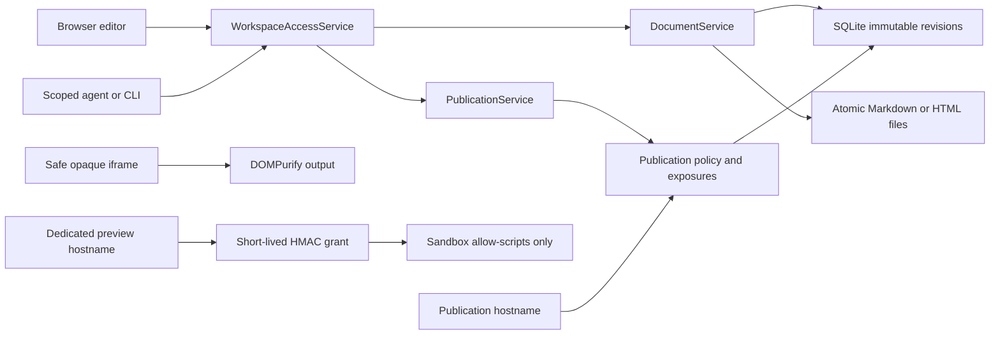

# Phase 4 implementation: HTML rendering and publishing

Phase 4 adds HTML as a first-class text document and makes publication a
read-only projection of the existing document/revision spine. It does not add a
second content store, a CMS write path, or a privileged agent route.

## Delivered workflow

A human can now:

- Create, materialize, reconcile, edit, search, compare, and restore Markdown
  and HTML documents through the same document service.
- Edit HTML with CodeMirror HTML syntax support.
- Preview untrusted HTML after DOMPurify sanitization in a script-disabled,
  opaque-origin iframe.
- Mark an HTML document as trusted through an explicit, attributed trust event.
- Run trusted JavaScript only through the dedicated preview origin, in an
  iframe with `allow-scripts` and without `allow-same-origin`.
- Publish a document with a stable slug and private, public, or unlisted access.
- Rotate an unlisted access token, unpublish immediately, and explicitly expose
  individual historical revisions.
- Render a selected historical revision before exposing or restoring it.

An agent with the `publish` capability can publish only documents inside its
path scope. Agents cannot mark HTML as trusted.

## Architecture



`DocumentService` remains the only content writer. HTML uses the same immutable
revision, optimistic-concurrency, idempotency, materialization, recovery, and
reconciliation protocol as Markdown.

`PublicationService` owns slugs, policy, active state, one-time unlisted
credentials, explicit revision exposure, document trust events, and preview
grants. A Publication stores no copied content. The stable URL resolves the
document's current revision at request time; a versioned URL resolves only an
explicitly exposed revision.

## Rendering zones

### Markdown

The browser continues to use `markdown-it`, then DOMPurify. Mermaid remains in
strict security mode. Relative image assets are fetched through a
publication-and-revision-authorized endpoint and converted to short-lived blob
URLs in the browser.

### Safe HTML

HTML is untrusted by default. DOMPurify removes scripts, event handlers,
iframes, objects, embeds, and base elements. The result is placed in an iframe
with an empty `sandbox` attribute and a CSP that sets `default-src 'none'` and
`script-src 'none'`. Published HTML always uses this safe renderer, even when
the source document is trusted for interactive preview.

### Trusted interactive HTML

Trust is a document property with its own monotonically increasing version and
immutable actor-attributed event history. It is deliberately not inferred from
path, author, import source, or publication state.

The application issues an HMAC-signed grant containing the document ID,
revision ID, exact relative asset references, random nonce, and expiry. The
credential is delivered in the URL fragment. Fragments are not sent in HTTP
requests; the preview bootstrap removes it from browser history and uses it in
an authorization header. Preview requests and responses use `no-store` and
`no-referrer`.

The preview iframe has `allow-scripts` but not `allow-same-origin`, so its
effective origin is opaque and it cannot read application credentials or DOM.
Its CSP denies network access unless an operator explicitly configures allowed
`connect-src` origins. Relative assets require the same live, scoped preview
grant. Removing document trust invalidates an already-issued grant at the next
request.

## Publication policy

- **Private:** requires the authenticated human administrator.
- **Public:** no credential is required.
- **Unlisted:** requires a high-entropy credential stored only as a SHA-256
  digest. The raw value is disclosed once and belongs in the URL fragment.
- **Latest URL:** `/p/<slug>` follows the current document revision.
- **Historical URL:** `/p/<slug>?revision=<revision_id>` succeeds only after
  that exact revision is exposed.
- **Unpublish:** disables the record and revokes every active unlisted token in
  one transaction.
- **Cache policy:** publication content, assets, preview shells, and preview
  content use `Cache-Control: no-store` so stale authorization state is not
  served.

Unexposed, unauthorized, inactive, and unknown publications all return the
same not-found response. There is no list endpoint on the public surface.

## Cloudflare boundary

Three hostnames route through one outbound-only Cloudflare Tunnel:

- The application hostname is protected by Cloudflare Access.
- The publication hostname remains outside Access so public and unlisted links
  work, while Sangam enforces Publication policy.
- The preview hostname remains outside Access and accepts only short-lived
  HMAC preview grants.

`cloudflare_access` authentication validates the signature, issuer, audience,
expiry, and configured email from `Cf-Access-Jwt-Assertion` before mapping the
request to the local human actor. The origin remains loopback-bound; no router
port is opened. See [Phase 4 operations](./operations/PHASE_4_OPERATIONS.md).

## Verification map

Automated backend coverage includes:

- HTML lifecycle, materialization, path/content-type matching, reconciliation,
  and prior Markdown compatibility.
- Stable latest publication behavior and explicit historical exposure.
- Non-enumerable unexposed revisions.
- Private, public, and unlisted access policy.
- One-time hashed unlisted tokens, rotation, revocation, and unpublish.
- Agent `publish` capability path enforcement and human-only trust changes.
- HMAC tampering, expiry, live trust revocation, exact asset scope, path
  traversal, no-store, referrer policy, and CSP assertions.
- Cloudflare Access JWT signature, issuer, audience, and email validation.

Frontend coverage and build checks include safe HTML sanitization, iframe
sandbox attributes, existing Markdown sanitization, runtime API schemas,
TypeScript production build, lint, formatting, and all browser unit tests.

Run the complete local verification:

```bash
just test
just test-docs
just docker-smoke
```

The real Cloudflare route, external DNS, Access policy, and cross-origin browser
behavior require operator-owned hostnames and credentials. They are a manual
release gate, not something the local test suite claims to prove.

## Phase boundary

Phase 4 does not add static-site generation, arbitrary routes, a theme product,
server-side rendering, PDF handling, Karakeep import, or AI chat.

## References

- [Cloudflare: publish a self-hosted application with Access][cf-access-app]
- [Cloudflare: validate Access JWTs at the origin][cf-validate-jwt]
- [Cloudflare Tunnel configuration and ingress validation][cf-tunnel-config]
- [MDN: iframe sandbox behavior][mdn-iframe]
- [MDN: Content Security Policy][mdn-csp]

[cf-access-app]: https://developers.cloudflare.com/cloudflare-one/access-controls/applications/http-apps/self-hosted-public-app/
[cf-validate-jwt]: https://developers.cloudflare.com/cloudflare-one/access-controls/applications/http-apps/authorization-cookie/validating-json/
[cf-tunnel-config]: https://developers.cloudflare.com/tunnel/advanced/local-management/configuration-file/
[mdn-iframe]: https://developer.mozilla.org/en-US/docs/Web/HTML/Reference/Elements/iframe#sandbox
[mdn-csp]: https://developer.mozilla.org/en-US/docs/Web/HTTP/Guides/CSP
