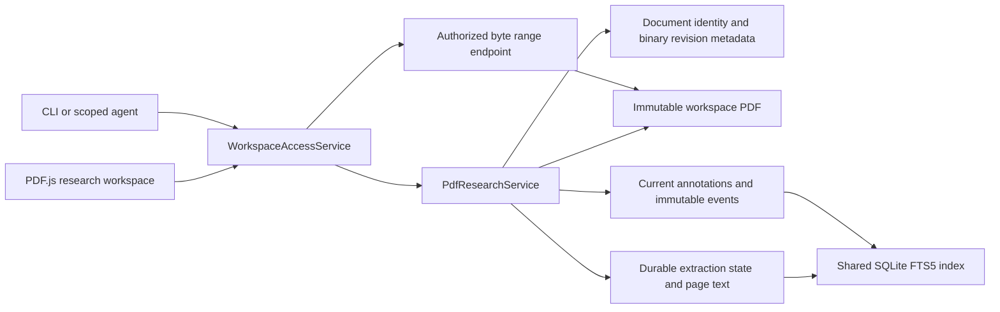

# Phase 5 implementation: PDF research workspace

Phase 5 adds immutable PDF Documents, searchable page text, and versioned
research annotations without introducing a binary revision store or an
alternate document writer. A PDF remains an ordinary workspace file. SQLite
is canonical for its stable identity, source hash, extraction state,
relationships, annotations, and annotation history.

## Delivered workflow

A human can now:

- Import a PDF directly into the materialized workspace.
- Open it in the browser with PDF.js, navigate pages, zoom, and search
  extracted page text.
- Select PDF text for a highlight or drag a normalized area highlight.
- Add comments, page notes, bookmarks, citation markers, colors, and tags.
- Edit or remove an annotation while retaining every actor-attributed version.
- Search annotation notes, selected text, and tags.
- Copy stable Markdown links to a PDF page or exact annotation.
- Import replacement bytes as a new Document with an explicit `supersedes`
  relationship while retaining the original PDF and hash.

The CLI can import PDFs, read or search extracted pages, and list or search
annotations. Scoped agents use the same API boundary: `create` authorizes an
import destination, `read` protects PDF bytes and annotation reads, `search`
protects page search, and `update` protects annotation mutations.

## Architecture



`DocumentService` remains the sole text and text-revision writer.
`PdfResearchService` owns the narrower binary lifecycle: import once, verify
the source hash on every binary read, extract text, and maintain annotation
state. It creates the initial Document and immutable binary metadata revision
in the same SQLite transaction after the source file has been atomically
written and verified.

PDFs return through the uniform Document API with `content_type` set to
`application/pdf`. Their text `content` is empty by design; the revision stores
the binary SHA-256 and byte size, not copied PDF bytes. The workspace file is
the durable source. Backups therefore remain responsible for both the SQLite
database and workspace files.

## Immutable source policy

- A PDF import must have a workspace-relative `.pdf` path and a valid PDF
  header.
- Import writes bytes through a sibling temporary file, flushes them, atomically
  renames them into place, and verifies the SHA-256.
- Text update, text restore, text reconciliation, text diff, duplication, and
  in-place source replacement reject PDF Documents explicitly.
- A changed source file becomes a reconciliation conflict. It cannot be
  accepted as a new revision of the same PDF.
- A missing PDF cannot be reconstructed from SQLite. It remains a visible
  conflict and must be restored from a verified backup.
- Replacement bytes create a new stable `document_id` and may reference the
  old PDF with `supersedes_document_id`.

This policy keeps old citations and annotations attached to the exact bytes
they were created against.

## Extraction and search

An imported PDF begins with persistent `pending` extraction state. The API
schedules extraction after the import response, and startup resumes any
`pending` or interrupted `processing` records. Extraction runs outside the
request handler thread, records attempts, page count, page text, completion
time, and a bounded error message.

States are `pending`, `processing`, `ready`, and `failed`. A failed extraction
does not block the byte endpoint or PDF.js reader. The browser shows the
failure and exposes an explicit retry. OCR is not attempted.

Extracted pages are stored with one-based page numbers. The document-level
FTS5 row includes page text plus live annotation selected text, notes, and
tags. The PDF-specific search endpoint also returns the matching page and a
page-aware snippet so the browser can navigate to the result.

## Range serving

`GET /api/v1/pdfs/{document_id}/content` authorizes `read` against the
Document's current path, verifies the file hash, advertises `Accept-Ranges:
bytes`, and supports one standard byte range per request. Full responses are
`200`; valid partial responses are `206` with `Content-Range`. Responses are
private and `no-store`.

PDF.js and its worker are lazy-loaded only for PDF Documents. The reader renders
one page at a time, overlays a selectable text layer, and stores highlight
geometry as normalized page coordinates so annotations remain aligned across
zoom levels and viewport sizes.

## Annotation protocol

Each Annotation has a stable ID, PDF document ID, one-based page number, type,
optional selected text and note, normalized rectangles, tags, color, actor
metadata, tombstone, and monotonically increasing version.

Every create, edit, or removal:

1. Authenticates and authorizes through `WorkspaceAccessService`.
2. Requires an actor-scoped idempotency key.
3. Checks the expected annotation version for edits and removals.
4. Updates the current annotation and appends an immutable snapshot event in
   one SQLite transaction.
5. Refreshes the shared search projection.

A stale expected version returns `409 Conflict` with the current version.
Removal is a tombstone event, not history deletion. Annotation history remains
readable after removal.

## Deep links

Stable internal URIs support page and annotation targets:

```text
sangam://document/DOCUMENT_ID?page=4
sangam://document/DOCUMENT_ID?page=4&annotation=ANNOTATION_ID
```

Markdown preview validates both identifiers, converts the URI to the browser
Document route, and preserves only the supported parameters. The research
workspace opens the requested page and selects the requested annotation.

## Verification map

Automated backend coverage includes:

- Atomic immutable import, source and file hashes, extraction status, page
  count, extracted page text, page search, and shared FTS5 search.
- Full and partial byte responses with range headers.
- Rejection of text mutation against PDF source bytes.
- Replacement import with a new Document ID and `supersedes` relationship.
- Text and area annotation validation, actor attribution, idempotency,
  optimistic conflicts, edits, tombstones, history, and search refresh.
- Migration idempotency and compatibility with every earlier phase test.
- CLI routing for binary import, page search, and annotation search.

Frontend verification includes the production TypeScript build, lazy PDF.js
and worker bundle, API schema validation, shared UI-system lint, narrow layout,
stable deep-link tests, and all existing browser unit tests.

Run the complete local gate:

```bash
just test
just test-docs
just docker-smoke
```

See [Phase 5 operations](./operations/PHASE_5_OPERATIONS.md) for import,
recovery, extraction retry, replacement, and hash verification procedures.

## Phase boundary

Phase 5 does not add OCR, live cursors, annotation export, annotated-PDF
generation, arbitrary source replacement, in-place PDF editing, Karakeep
import, or built-in AI chat.
