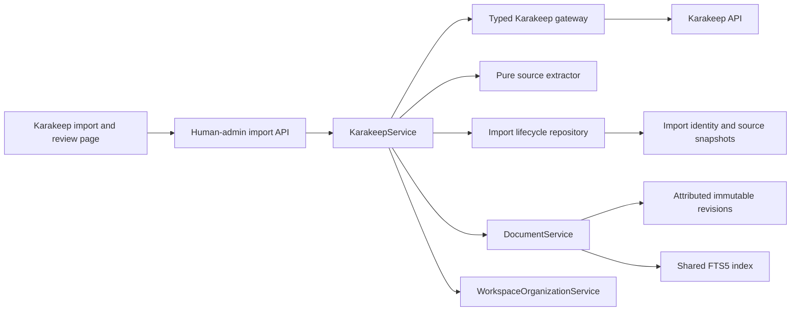

# Phase 6 implementation: Karakeep confluence

Phase 6 adds selective Karakeep import as a client of Sangam's existing
document server. Karakeep remains the archive of record. Sangam stores an
editable Markdown working copy, durable provenance, and immutable extraction
snapshots without introducing a generic synchronization framework or an
alternate revision writer.

## Delivered workflow

A human can now:

- Verify that Sangam can authenticate to Karakeep and read bookmarks.
- Search Karakeep with its normal query language and import one selected item.
- Inspect the original URL, Karakeep ID, author, archive timestamps, tags, and
  available attachment descriptors.
- Edit the imported Markdown through the normal Sangam editor and revision
  protocol.
- Re-import the same bookmark without creating another Document.
- Explicitly refresh a source and compare its accepted extraction with the
  corrected working copy.
- Review and edit changed extracted Markdown before applying it as a normal
  human-attributed revision.
- Retry a failed or process-interrupted import from durable failure state.

The Karakeep browser page is intentionally human-administrator-only. API keys
remain server-side and are never returned by an API schema, embedded in browser
state, or recorded in operation details.

## Architecture



`KarakeepService` coordinates the use case without interpreting HTTP payloads
or embedding SQL. The gateway validates remote JSON and returns typed source
bookmarks, the pure extractor owns HTML-to-Markdown and provenance rules, and
the repository owns the durable import state machine. `DocumentService`
remains the only creator and updater of text Documents. Initial content is attributed to
`integration:karakeep`; a reviewed refresh is attributed to the human who
applies it.

SQLite remains canonical for import identity and snapshot state. The imported
Markdown is an unmaterialized Document by default, so the human may review it
before choosing whether to materialize it as an ordinary workspace file.

## Connection and source contract

The adapter follows Karakeep's versioned `/api/v1` HTTP API:

- `GET /bookmarks?limit=1` checks authentication and bookmark-read permission.
- `GET /bookmarks/search` performs cursor-aware search without full content.
- `GET /bookmarks/{bookmark_id}?includeContent=true` retrieves a selected
  bookmark with content, tags, and asset descriptors.

The configured API root must include `/api/v1`. Sangam sends the API key as a
Bearer token from the server. It rejects source payloads larger than
`SANGAM_MAX_KARAKEEP_SOURCE_BYTES` before extraction or persistence.

Link HTML is converted to Markdown with `markdownify`. Text and asset bookmarks
fall back to their extracted text. The working copy receives a small
provenance header containing the stable Karakeep ID, source URL, author, and
archive time. Script, style, and noscript elements are excluded during
conversion.

## Import identity and provenance

`karakeep_imports.bookmark_id` is unique. A successful repeat import returns
the existing import and Document even when the HTTP request uses a new
idempotency key. Initial import stores the source snapshot before creating the
Document, then links the Document immediately. The Document mutation uses a
stable internal idempotency key; if the process stops after creation but before
linkage, retry recovers the exact Document ID from that idempotency record and
finishes the existing import instead of creating another Document or revision.

Each source snapshot records:

- Original URL, title, author, and Karakeep archive timestamps.
- Source tags and available asset IDs, types, and filenames.
- The bounded source payload and archived HTML used for extraction.
- The extracted Markdown and its SHA-256 content hash.

Karakeep tags are created idempotently and merged into the Document's current
tags. A refresh never removes human organization metadata. Attachment
descriptors are provenance in this phase; Sangam does not duplicate Karakeep's
archived attachment bytes.

## Refresh and correction safety

A refresh never updates the Document silently:

1. Sangam retrieves and normalizes the current Karakeep source.
2. An unchanged extraction returns the import to `current` without a revision.
3. A changed extraction becomes `pending_snapshot_id` and the import enters
   `review_required`.
4. The browser shows the accepted extraction beside the corrected working copy
   and exposes the proposed Markdown in an editable review field.
5. Applying the reviewed content requires the Document's expected revision.
6. `DocumentService` creates the human-attributed revision, then the pending
   snapshot becomes the accepted source.

A concurrent edit returns `409 Conflict`; the refresh remains available for a
new review against the newer working copy. This preserves human corrections
unless the human deliberately includes or replaces them in reviewed content.

## Durable states and restart behavior

Import state is `importing`, `current`, `review_required`, or `failed`.
Attempts, successes, bounded failure details, and source snapshots are durable.
On startup, Sangam marks an interrupted `importing` record as `failed` with an
explicit retry message. A failed initial import may be retried by selecting the
same bookmark; a failed refresh retains the last accepted snapshot and working
Document.

## Verification map

Automated backend coverage includes:

- Connection and permission health, bookmark search, real response-shape
  normalization, HTML-to-Markdown conversion, metadata, tags, and attachment
  descriptors.
- Integration attribution, shared FTS5 search, stable bookmark identity, and
  repeat-import idempotency.
- Human corrections, changed-source refresh, three-way review inputs, no
  silent overwrite, expected-revision application, and human attribution.
- Durable failure recording, explicit retry, migration idempotency, and all
  earlier phase tests.
- Invalid remote payload rejection at the gateway, pure extraction rules, and
  an injected post-creation linkage failure proving retry reconnects exactly
  one Document.

Frontend verification includes formatting, TypeScript production build,
schema validation, UI-system lint, browser unit tests, and desktop and narrow
browser inspection of the connection, selective import, source comparison, and
refresh review states.

Run the complete local gate:

```bash
just test
just test-docs
just docker-smoke
```

See [Phase 6 operations](./operations/PHASE_6_OPERATIONS.md) for configuration,
credential rotation, source limits, retry, and recovery procedures.

## Phase boundary

Phase 6 does not continuously mirror Karakeep, crawl arbitrary websites,
download every archived attachment into Sangam, replace Karakeep, or provide a
generic bidirectional synchronization engine. Built-in AI chat remains Phase 7.
