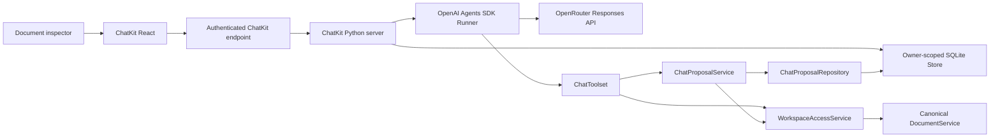

# Phase 7 implementation: workspace-grounded chat

Phase 7 adds chat as a client of Sangam's existing document server. It does not
add a second document writer, a scheduler, or a home-grown streaming protocol.
ChatKit owns the chat protocol and UI, the OpenAI Agents SDK owns the tool loop,
and OpenRouter supplies the configured Responses-compatible model.

## Delivered workflow

A human can now:

- Open per-document chat in the existing right inspector.
- Choose an enabled OpenRouter model from ChatKit's model picker.
- Stream answers, structured workflow traces, errors, and citations.
- Browse durable history, stop an active response, and retry a response.
- Ground requests in the current document or editor selection.
- Search and read authorized Documents and PDF pages with live annotations.
- Create a Document or publication only through existing authorized services.
- Review a full diff before applying a proposed existing-document update.
- Receive a stale conflict when the Document changes before proposal approval.

## Architecture



`SangamChatServer` subclasses ChatKit's server abstraction. ChatKit creates and
serializes threads, persists completed items, streams native events, marks
cancelled responses, and implements retry semantics. `stream_agent_response`
adapts the Agents SDK event stream into those native events. Sangam does not
parse provider SSE in the browser or implement a parallel tool-call loop.

`ChatToolset` contains the importable tool implementations and owns bounded
workflow-task reporting. `ChatProposalService` coordinates authorization and
canonical document updates while `ChatProposalRepository` concentrates all
owner-scoped proposal SQL. The chat server therefore does not reach into Store
internals or issue proposal queries directly.

The Agents SDK uses `OpenAIProvider` with an `AsyncOpenAI` client whose base URL
is OpenRouter. `use_responses=True` keeps the integration on the Responses API,
including native function calls and streaming. OpenAI tracing is disabled
because the configured credential belongs to OpenRouter, not the OpenAI
platform.

## Durable thread and ownership model

ChatKit thread metadata, thread items, and attachment metadata are stored as
versioned SDK JSON in SQLite. Relational columns retain the owner, current
Document association, timestamps, and proposal relationships needed for local
authorization and operations. Every store read, page, mutation, and delete is
scoped to the authenticated actor. An unknown thread and another actor's thread
both return the same not-found behavior.

The configured context window bounds the number of durable items passed to a
model. Search result counts, PDF annotations, document content, tool JSON, and
editor selection are separately bounded. Provider credentials never enter a
thread, event, browser response, or model tool result.

## Grounding and tools

The request context carries only the authenticated Principal and current stable
Document ID. A compact developer context records the title, current revision,
and content type, then instructs the model to read content through tools.
Browser-only selected text is fetched on demand with ChatKit's client-tool
round trip instead of being encoded into custom transport fields.

The Agent exposes these strict function tools:

- `get_editor_selection`
- `search_workspace`
- `read_document`
- `read_pdf_page`
- `propose_update`
- `create_document`
- `publish_document`

Every server tool enters through `WorkspaceAccessService`, so token capability
and path restrictions remain identical to the HTTP API. Search and reads return
`chatkit-link://document` citations pinned to the stable Document ID and exact
revision, plus a PDF page number when relevant. ChatKit renders the tool work as
an expandable workflow trace and routes citation clicks back to the React app.

## Proposal and mutation safety

`propose_update` checks update capability and the expected revision, then stores
the proposed full content without changing the Document. The inspector renders
the proposal with the shared Pierre diff view. Applying it calls the existing
`WorkspaceAccessService.update_document` method with the reviewed revision and
the human Principal. The resulting immutable revision therefore has normal
human attribution, materialization behavior, search indexing, activity, and
conflict semantics.

Before the document mutation begins, the proposal repository durably reserves
the first apply idempotency key. If the process stops after the document
revision commits but before the proposal status changes, a later apply resumes
with that same key, receives the existing revision from `DocumentService`, and
marks the proposal applied. A reserved proposal cannot be dismissed while its
apply is recoverable. This closes the cross-transaction failure window without
adding a second document writer or passing database connections through the
workspace access boundary.

Create and publish tools are reserved for explicit user requests and call the
same service boundary with deterministic idempotency keys. A proposed update
never claims to be applied, and a concurrent change marks it stale after the
normal conflict response.

## Browser and hosting boundary

The self-hosted ChatKit backend, model calls, messages, and attachments remain
under Sangam's control. ChatKit's iframe UI and bootstrap script are hosted by
OpenAI. The application CSP allows only the documented ChatKit CDN script and
OpenAI iframe origins in addition to Sangam's existing sources. Production must
register the application origin and replace the `local-dev` domain key.

## Verification map

Automated coverage verifies:

- Migration idempotency and the full earlier-phase suite.
- ChatKit-native thread creation, event framing, cancellation availability, and
  recoverable unconfigured-runtime errors.
- Durable thread replay and actor ownership isolation.
- Model allowlisting and the exact exposed Agents SDK function-tool set.
- Proposal review, normal human-attributed application, and stale conflicts.
- Proposal-apply recovery after interruption and identity-safe workflow-task
  failure reporting.
- Stable per-Document ChatKit remounting so navigation cannot reuse another
  Document's thread ID.
- Frontend schema validation, formatting, production build, UI-system lint, and
  browser unit tests.

Live local verification used OpenRouter with `openai/gpt-5.4-nano` and proved a
streamed assistant response, a real `read_document` function call, an expandable
workflow trace, exact content grounding, and a revision-pinned citation. Browser
inspection verified the right rail at 1440, 820, and 390 CSS pixels without
horizontal overflow. The Docker smoke gate also verifies native ChatKit thread
creation and durable recovery after a container restart.

Run:

```bash
just test
just test-docs
just docker-smoke
```

See [Phase 7 operations](./operations/PHASE_7_OPERATIONS.md) for configuration,
model changes, key rotation, diagnostics, and the production release gate.

## Phase boundary

Phase 7 does not add autonomous background agents, a general ReAct framework,
multi-agent coordination, hidden privileged tools, local model hosting, or a
second write path. It composes maintained OpenAI chat and agent abstractions
with OpenRouter and Sangam's existing access boundary.
