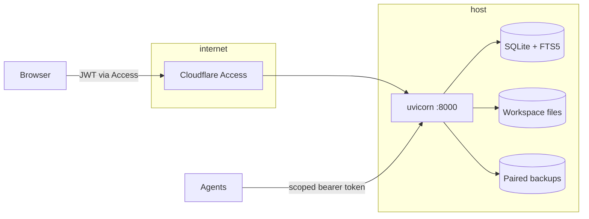

# Sangam architecture

Sangam is a small, self-hosted document server for humans and agents. One person and a set of scoped AI agents edit ordinary files through the same revision-aware API. Every mutation carries an actor, an expected revision, and an idempotency key; every agent edit lands as a human-reviewed proposal, never as a silent direct write.

## Core concepts

- **Document** — the unit of identity: a path (like `research/notes.md`), a content type (`text/markdown`, `text/html`, `application/pdf`), tags/categories, and an immutable revision chain.
- **Revision** — every save creates a new immutable revision. Diffing, restore, and publication all point at revisions, so history can never be rewritten.
- **Workspace** — a plain directory tree on disk that mirrors the database. The SQLite database is canonical; files are materialized for portability, grep-ability, and editor access.
- **Reconciliation** — a service that compares the database against materialized files and reports drift. Conflicts are surfaced in the UI and resolved explicitly, never auto-overwritten.
- **Publication** — a revision exposed at a stable URL as private, unlisted, or public.
- **Actor** — `human:jay` or `agent:<name>`. Every change is attributed.

## Trust model

Sangam runs single-user. Everything inside the boundary belongs to one administrator. Three auth modes cover the deployment spectrum:

| Mode | Who authenticates | Typical use |
| --- | --- | --- |
| `single_user` | No request auth; loopback only | Local development |
| `trusted_proxy` | A reverse proxy injects a trusted identity header | Tailnet or private network |
| `cloudflare_access` | Cloudflare Access JWT validated per request (team domain, audience, email) | Public HTTPS |

Two rendering zones exist for HTML:

- **Safe zone** — workspace documents and published pages are sanitized (DOMPurify) and rendered without scripting.
- **Trusted preview zone** — interactive HTML/JavaScript executes under `/trusted-preview`. Since v0.3.0 this is same-origin; access is gated by a short-lived HMAC token (`SANGAM_PREVIEW_HMAC_SECRET`, which has a development default). Production compose deployments pin explicit parent origins, the preview base URL, and optional `connect-src` allowances.

Whether saved HTML revisions may execute JavaScript at all is itself a workspace policy: `GET/PUT /api/v1/settings/html-javascript` (on by default, optimistic versioning, every change attributed and recorded). Disabling it makes even trusted previews inert until re-enabled.

## Data and storage

SQLite is the canonical store: documents, revisions, FTS5 search index, publications, chat threads, activity ledger. Content is also materialized to the workspace directory atomically (write-temp-then-rename), so the file tree is always generation-consistent with the database snapshot it came from.

Backups are paired artifacts: one SQLite dump plus one workspace tarball taken from the same generation, written to `SANGAM_BACKUP_ROOT`, rotated by count, and periodically self-verified. A backup is only considered ready when verification passes within the configured max age.

## Search

Full-text search runs on SQLite FTS5 across documents and PDF page text. Query results link back to exact documents (and page numbers for PDFs).

## Agent access model

Agents never share the human's session. Each agent gets a bearer token created in Settings or via the API with:

- **Capabilities** — read, write, publish, and similar scopes
- **Path boundaries** — token works only under a path prefix (for example `projects/agent-x/`)
- **Expiry and rotation** — tokens expire, can be rotated and revoked independently

Every agent mutation must carry the expected revision and an idempotency key. Conflicts return `409` with the current state so the agent can re-read and retry. All agent actions are recorded in an append-only activity ledger visible in the UI.

Chat-grounded edits go further: the assistant produces a **proposal** (a suggested new revision) that the human reviews and applies. Proposals are recoverable and pinned to the revision they were generated from.

## PDF research

PDFs are imported immutably (SHA-256 tracked), page text is extracted into FTS5 in a background job, and pages are served by byte range. Annotations and notes are pinned to exact pages with optimistic versioning. A PDF can be replaced via `supersedes`, which preserves the old document's identity chain.

## Publishing

Any revision can be published as private, unlisted, or public with a custom slug at `SANGAM_PUBLICATION_BASE_URL`. Published pages render sanitized HTML. Trusted interactive previews use the separate `/trusted-preview` zone described above.

## Chat runtime

Chat is first-class: the sidebar links straight into **Workspace chat**, and readiness (`/readiness`) fails if the chat runtime cannot start, so "app is up" always means "chat works". Chat uses ChatKit UI with the OpenAI Agents SDK. Connections are provider-neutral: an OpenRouter preset or any OpenAI-compatible endpoint (`base_url` + key). Threads are durable and owner-scoped. Grounding tools let the assistant search the workspace, read documents, inspect stable organization metadata, and draft revision-pinned proposals. Exact organization plans and direct explorer actions share one preflight and execution service behind `WorkspaceAccessService`; neither chat nor the browser writes SQLite or files directly. Private effects use exact review by default or bounded administrator-only workspace autonomy, while publication always requires review. Model and permission selection live in Settings. See [chat-capabilities.md](chat-capabilities.md) (and the [lifecycle diagram](assets/chat-capability-lifecycle.html)) for capability descriptors and effect contracts, and [operations/integrations.md](operations/integrations.md) for provider setup.

## Karakeep bridge

Archived Karakeep bookmarks can be imported selectively as editable Markdown. Provenance (original URL, capture time) is preserved, imports are idempotent, and refreshes surface diffs for review instead of silently overwriting edits.

## Recovery

Restore always means: stop writes, restore the paired pair together, run reconciliation, verify. Upgrades are forward-only migrations. Rollback is deploying the previous image digest plus a full paired restore. See [operations/backups.md](operations/backups.md).
