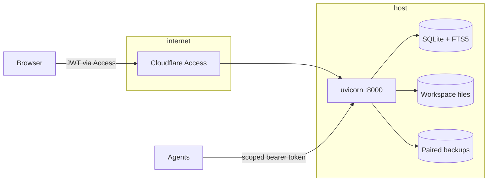

# Sangam architecture

Sangam is a small, self-hosted document server for humans and agents. One person and a set of scoped AI agents edit ordinary files through the same revision-aware API. Every mutation carries an actor, an expected revision, and an idempotency key; every agent edit lands as a human-reviewed proposal, never as a silent direct write.

## Core concepts

- **Document** — the unit of identity: a path (like `research/notes.md`), a content type (`text/markdown`, `text/html`, `application/pdf`), tags/categories, and an immutable revision chain.
- **Revision** — every save creates a new immutable revision. Diffing, restore, and publication all point at revisions, so history can never be rewritten.
- **Workspace** — a plain directory tree on disk that mirrors the database. The SQLite database is canonical; files are materialized for portability, grep-ability, and editor access.
- **Reconciliation** — a service that compares the database against materialized files and reports drift. Conflicts are surfaced in the UI and resolved explicitly, never auto-overwritten.
- **Publication** — a revision exposed at a stable URL as private, unlisted, or public.
- **Actor** — `human:jay` or `agent:<name>`. Every change is attributed.
- **Operation** — one call through `WorkspaceAccessService.audited`. Each operation declares its ledger name and whether it reads or writes (`reads(...)` or `writes(...)` in `access.py`).

## Write path

Every change reaches storage through one entry point, and every document change through one protocol:

1. **Access.** `WorkspaceAccessService.audited` runs each operation under the activity-ledger contract. A write records exactly one ledger row: inside the first transaction it commits, or after it returns if it committed nothing. Denials, conflicts, and failures are recorded too. Reads are recorded only for non-human principals. HTTP routes, chat, organization plans, Karakeep, backups, tokens, and settings enter here. Projects and saved views enter here too. The administrator check also records a denial before any operation runs.
2. **Document writes.** `WorkspaceAccessService.write_document` is the single path for update, duplicate, tag, materialize, move, delete, restore, and trust changes. HTTP routes, chat proposals, and organization plans all call it with the same request bodies. It authorizes the fresh source and destination paths, requires an expected revision unless HTTP `If-Match`/`If-None-Match` conditions are given, and records the diff.
3. **Commit pipeline.** `DocumentService._commit` is the one storage protocol. Inside the committing transaction it checks the actor, replays a reused idempotency key, re-checks the expected revision, writes the revision, binds the key, and names the ledger target. PDF bytes live only on disk, so a PDF move, trash, or restore first applies a file step that the pipeline undoes if the commit fails. After the commit it materializes text, removes stale files, and re-indexes search.
4. **Idempotency.** `IdempotencyStore` owns both key tables. Other modules ask it whether a key committed; none of them query the tables directly.

Chat runs outlive the request that started them, so every chat tool call and effect decision first refreshes the run principal's token grants. A token revoked mid-run cannot read, propose, or execute an effect, including in YOLO mode.

## Trust model

Sangam runs single-user. Everything inside the boundary belongs to one administrator. Three auth modes cover the deployment spectrum:

| Mode | Who authenticates | Typical use |
| --- | --- | --- |
| `single_user` | No request auth; loopback only | Local development |
| `trusted_proxy` | A reverse proxy injects a trusted identity header | Tailnet or private network |
| `cloudflare_access` | Cloudflare Access JWT validated per request (team domain, audience, email) | Public HTTPS |

```mermaid
flowchart LR
    subgraph internet
        CF[Cloudflare Access]
    end
    subgraph host
        U[uvicorn :8000] --> DB[(SQLite + FTS5)]
        U --> WS[(Workspace files)]
        U --> BK[(Paired backups)]
    end
    Browser -->|JWT via Access| CF --> U
    Agents -->|scoped bearer token| U
```

Two rendering zones exist for HTML:

- **Safe zone** — workspace documents and published pages are sanitized (DOMPurify) and rendered without scripting.
- **Trusted preview zone** — interactive HTML/JavaScript executes under `/trusted-preview`. Since v0.3.0 this is same-origin; access is gated by a short-lived HMAC token (`SANGAM_PREVIEW_HMAC_SECRET`, which has a development default). Production compose deployments pin explicit parent origins, the preview base URL, and optional `connect-src` allowances.

Whether saved HTML revisions may execute JavaScript at all is itself a workspace policy: `GET/PUT /api/v1/settings/html-javascript` (on by default, optimistic versioning, every change attributed and recorded). Disabling it makes even trusted previews inert until re-enabled.

## Data and storage

SQLite is the canonical store: documents, revisions, FTS5 search index, publications, chat threads, activity ledger. Content is also materialized to the workspace directory atomically (write-temp-then-rename), so the file tree is always generation-consistent with the database snapshot it came from.

Backups are paired artifacts: one SQLite dump plus one workspace tarball taken from the same generation, written to `SANGAM_BACKUP_ROOT`, rotated by count, and periodically self-verified. A backup is only considered ready when verification passes within the configured max age.

## Search

Full-text search runs on SQLite FTS5 across documents, PDF page text, and annotations. FTS chooses and ranks the documents; Sangam then rescans only the returned page to locate up to three passages per result (`search_matches`): the source (document text, PDF page, annotation, title, path, or metadata), a highlighted snippet, and the exact location (line and nearest heading, PDF page, or annotation). Search results open the editor on that line or the PDF on that page.

Images added to a document are stored once in the workspace's shared `attachments/` folder as `<name>-<sha16>.<ext>` and referenced root-relative (`/attachments/...`). The reference never depends on the document's location, so moving a document or renaming its folder cannot break it, and drafts without a location can hold images. Root-relative links render in GitHub, VS Code, and static-site tools that treat the workspace as their root. Only PNG, JPEG, GIF, and WebP are accepted; SVG is refused.

Saved views (`/api/v1/saved-views`) store a named search query and filters on the server for the workspace owner, so they follow the owner across devices.

SQLite triggers record changed document IDs in `search_dirty_documents` in the
same transaction as searchable source changes. Index synchronization reads the
canonical state and removes that marker in one transaction. Startup repairs
only pending IDs, so healthy startup does not rebuild the corpus. The migration
marks existing documents for one initial rebuild. Explicit reindexing remains
available for maintenance. Changes to indexed fields must also update the
trigger coverage.

## Agent access model

Agents never share the human's session. Each agent gets a bearer token created in Settings or via the API with:

- **Capabilities** — read, write, publish, and similar scopes
- **Path boundaries** — token works only under a path prefix (for example `projects/agent-x/`)
- **Expiry and rotation** — tokens expire, can be rotated and revoked independently

Every agent mutation must carry the expected revision and an idempotency key. Conflicts return `409` with the current state so the agent can re-read and retry. All agent actions are recorded in an append-only activity ledger visible in the UI.

`GET /api/v1/activity` provides bounded chronological pages and exact filters;
`GET /api/v1/activity/summary` computes bounded outcome, actor, document,
publication, problem, and token-health aggregates in SQLite. The client never
derives workspace totals from a page of events. `operation_id` is the only
durable grouping key and is not a session or run identifier. The ledger is
currently retained without an automatic deletion policy; retention controls
require a separate, explicit migration and operating policy.

Chat-grounded edits go further: the assistant produces a **proposal** (a suggested new revision) that the human reviews and applies. Proposals are recoverable and pinned to the revision they were generated from.

## PDF research

PDFs are imported immutably (SHA-256 tracked), page text is extracted into FTS5 in a background job, and pages are served by byte range. Annotations and notes are pinned to exact pages with optimistic versioning. A PDF can be replaced via `supersedes`, which preserves the old document's identity chain. In the workspace, PDFs participate in organization plans alongside Markdown and HTML: they can be moved, renamed, duplicated (as clean copies without annotations), and moved to managed trash with byte retention and restoration.

## Publishing

A publication is pinned to one exact revision (`publications.revision_id`) and is private, unlisted, or public with a custom slug at `SANGAM_PUBLICATION_BASE_URL`. Saving the draft does not change what readers see; the editor shows when the published revision differs from the saved draft and links to that comparison. Publishing a newer revision is a deliberate `PATCH /api/v1/publications/{id}` with `revision_id`. Older revisions are readable only after an explicit exposure. Published pages render sanitized HTML. Trusted interactive previews use the separate `/trusted-preview` zone described above.

## Chat runtime

Chat is first-class: the sidebar links straight into **Workspace chat**, and readiness (`/readiness`) fails if the chat runtime cannot start, so "app is up" always means "chat works". Chat uses ChatKit UI with the OpenAI Agents SDK. Connections are provider-neutral: an OpenRouter preset or any OpenAI-compatible endpoint (`base_url` + key). Threads are durable and owner-scoped. Grounding tools let the assistant search the workspace, read documents, inspect stable organization metadata, and draft revision-pinned proposals. Exact organization plans and direct explorer actions share one preflight and execution service behind `WorkspaceAccessService`; neither chat nor the browser writes SQLite or files directly. Review mode pauses every effect for an exact decision. YOLO mode runs every effect, including publication, without approval prompts after the same actor, scope, revision, and path authorization checks pass. Model and permission selection live in Settings. See [chat-capabilities.md](chat-capabilities.md) (and the [lifecycle diagram](assets/chat-capability-lifecycle.html)) for capability descriptors and effect contracts, and [operations/integrations.md](operations/integrations.md) for provider setup.

## Karakeep bridge

Archived Karakeep bookmarks can be imported selectively as editable Markdown. Provenance (original URL, capture time) is preserved, imports are idempotent, and refreshes surface diffs for review instead of silently overwriting edits.

## Recovery

Restore always means: stop writes, restore the paired pair together, run reconciliation, verify. Upgrades are forward-only migrations. Rollback is deploying the previous image digest plus a full paired restore. See [operations/backups.md](operations/backups.md).
